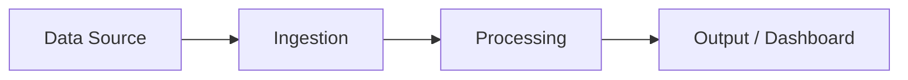
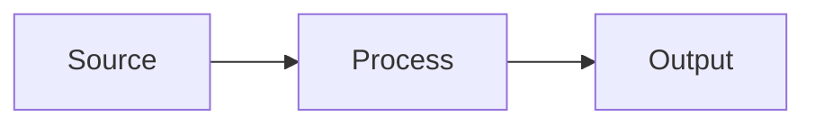

← [README](README.md) | 🎤 Demo & Handoff Phase

# Hackathon Handoff — [Customer Name]

**Date:** [FILL]
**Squad:** [FILL]

---

## Executive Summary

[FILL — 1 paragraph summarizing what was accomplished, key outcomes, and recommended next steps. Written for a senior stakeholder who wasn't in the room.]

---

## Use Cases Delivered

| # | Use Case | Status | Pattern / Accelerator | Demo-Ready? |
|---|----------|--------|-----------------------|-------------|
| 1 | [FILL] | ✅ Complete / 🟡 Partial / ❌ Deferred | [FILL] | Yes / No |
| 2 | [FILL] | ✅ / 🟡 / ❌ | [FILL] | Yes / No |
| 3 | [FILL] | ✅ / 🟡 / ❌ | [FILL] | Yes / No |

---

## Use Case Details

### UC-1: [Use Case Name]

**Problem:** [What pain point does this address?]

**Solution:** [What did we build? How does it work?]

**Architecture:**

*Replace with actual architecture diagram.*

**Demo Walkthrough:**
1. [Step 1]
2. [Step 2]
3. [Step 3]

**Next Steps:**
- [ ] [What needs to happen to move this forward]
- [ ] [FILL]

---

### UC-2: [Use Case Name]

**Problem:** [FILL]

**Solution:** [FILL]

**Architecture:**

**Demo Walkthrough:**
1. [Step 1]
2. [Step 2]

**Next Steps:**
- [ ] [FILL]

---

*(Copy section for additional use cases.)*

---

## Productionization Roadmap

*What would it take to move these PoCs into production?*

| Aspect | Current (PoC) | Production Target | Effort Estimate |
|--------|--------------|-------------------|-----------------|
| Data pipeline | Manual / sample data | Automated, real-time | [FILL] |
| Security | Demo credentials | Managed identity, RBAC | [FILL] |
| Scalability | Single-user | Multi-tenant | [FILL] |
| Monitoring | None | Full observability | [FILL] |
| CI/CD | Manual deploy | Automated pipeline | [FILL] |

**Recommended production timeline:** [FILL]

---

## Follow-Up Actions

| # | Action | Owner | Target Date | Status |
|---|--------|-------|-------------|--------|
| 1 | [FILL] | [FILL] | [FILL] | ⬜ Open |
| 2 | [FILL] | [FILL] | [FILL] | ⬜ Open |
| 3 | [FILL] | [FILL] | [FILL] | ⬜ Open |

---

## Appendix

### Architecture Decisions Made

*Decisions captured during the hackathon. See `architecture/decisions/` for full ADC records.*

| Decision | Why | Revisit for Production? |
|----------|-----|------------------------|
| [FILL] | [FILL] | Yes / No |
| [FILL] | [FILL] | Yes / No |

### Data Sources Used

| Source | Description | Access Method | Notes |
|--------|-------------|---------------|-------|
| [FILL] | [FILL] | [FILL] | [FILL] |

### Azure Resources Provisioned

| Resource | Type | Resource Group | Disposition |
|----------|------|---------------|-------------|
| [FILL] | [FILL] | [FILL] | Keep / Archive / Destroy |

---

## 📎 Related Documents

| Document | Purpose |
|----------|---------|
| [Demo Script Template](templates/demo-script-template.md) | 5-part demo narrative structure |
| [Architecture Decisions](architecture/decisions/_template.md) | ADC template |
| [Wind-Down Checklist](.hackathon/checklist-winddown.md) | Post-hackathon checklist |
| → [Retrospective](RETRO.md) | **Next:** Team retrospective & knowledge extraction |
