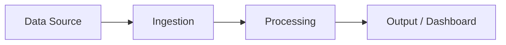
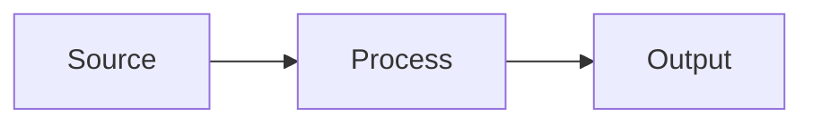

← [README](README.md) | 🎤 Demo → Wind-Down

# 🎤 Hackathon Handoff — [Customer Name]

> This is your victory lap document. You built working demos in [X] days — document it with the pride it deserves.
> This goes to the customer's boss. Make it count.

**Date:** [When did this happen?]
**Squad:** [Who was in the room?]

---

## Executive Summary

*Write this for someone who wasn't in the room but needs to know why this matters. One paragraph. Lead with outcomes, not process.*

> [What did we build? What did it prove? What should happen next?]

---

## Use Cases Delivered

| # | Use Case | Status | Pattern / Accelerator | Demo-Ready? |
|---|----------|--------|-----------------------|:-:|
| 1 | | ✅ Complete / 🟡 Partial / ❌ Deferred | | Yes / No |
| 2 | | ✅ / 🟡 / ❌ | | Yes / No |
| 3 | | ✅ / 🟡 / ❌ | | Yes / No |

---

## Use Case Details

### UC-1: [Use Case Name]

**The pain:** *[What hurts today? Use the customer's words.]*

**What we built:** *[Plain English — what does it DO, not how was it built]*

**The "aha" moment:** *[What made the room react during the demo?]*

**Architecture:**

*Replace with actual architecture diagram.*

**Demo Walkthrough:**
1. [Step 1]
2. [Step 2]
3. [Step 3]

**What comes next:**
- [ ] [The obvious next step — the one the customer is already nodding about]
- [ ] [The infrastructure step — what needs to happen before production]

---

### UC-2: [Use Case Name]

**The pain:** *[What hurts today?]*

**What we built:** *[What does it do?]*

**The "aha" moment:** *[What made the room react?]*

**Architecture:**

**Demo Walkthrough:**
1. [Step 1]
2. [Step 2]

**What comes next:**
- [ ] [Next step]

---

*(Copy section for additional use cases.)*

---

## Productionization Roadmap

*What would it take to move these PoCs into production? Be honest — this builds trust.*

| Aspect | Current (PoC) | Production Target | Effort Estimate |
|--------|--------------|-------------------|-----------------|
| Data pipeline | Manual / sample data | Automated, real-time | |
| Security | Demo credentials | Managed identity, RBAC | |
| Scalability | Single-user | Multi-tenant | |
| Monitoring | None | Full observability | |
| CI/CD | Manual deploy | Automated pipeline | |

**Recommended production timeline:** *[Be realistic — optimism here erodes trust]*

---

## 🚀 Next Steps — The Momentum

*This section should feel like a handshake, not homework. These are the actions that keep the energy alive.*

| # | Action | Owner | Target Date | Status |
|---|--------|-------|-------------|--------|
| 1 | | | | ⬜ Open |
| 2 | | | | ⬜ Open |
| 3 | | | | ⬜ Open |

> 💡 **Pro tip:** Schedule the first follow-up before you leave the room. Momentum dies in inboxes.

---

## Appendix

### Architecture Decisions Made

| Decision | Why | Revisit for Production? |
|----------|-----|:-:|
| | | Yes / No |
| | | Yes / No |

### Data Sources Used

| Source | Description | Access Method | Notes |
|--------|-------------|---------------|-------|
| | | | |

### Azure Resources Provisioned

| Resource | Type | Resource Group | Disposition |
|----------|------|---------------|-------------|
| | | | Keep / Archive / Destroy |

---

## 📎 Related Documents

| Document | Purpose |
|----------|---------|
| [Demo Script Template](playbook/demo-script-template.md) | 5-part demo narrative structure |
| [Architecture Decisions](build/decisions/_template.md) | ADC template |
| [Wind-Down Checklist](playbook/checklists.md) | Post-hackathon checklist |
| → [Retrospective](RETRO.md) | **Next:** Team retrospective & knowledge extraction |
