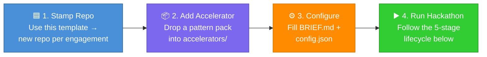
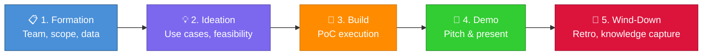
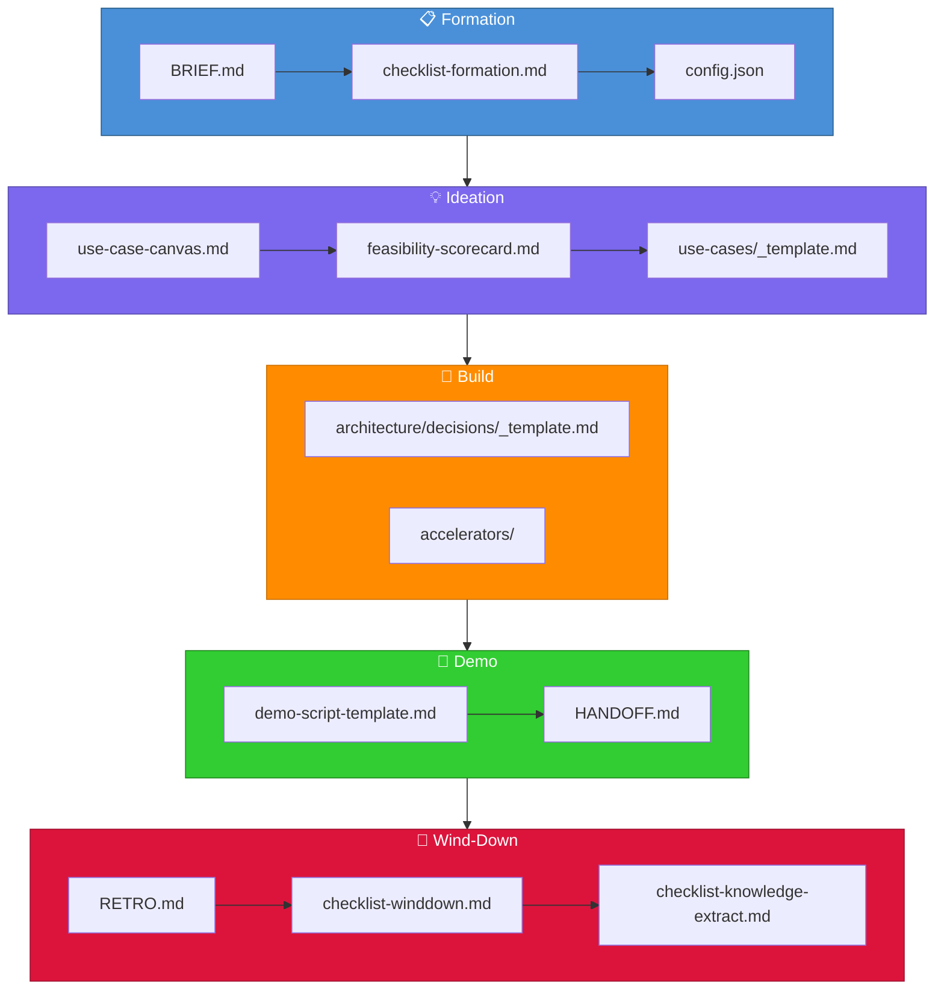

# Squad Hackathon Template

> A stamped-and-go template for running business hackathons — from ideation to PoC delivery — powered by a dispatched AI squad.

---

## What Is This?

This is a **hackathon template repo** dispatched from [squad-headquarters](https://github.com/sarahmoens/squad-headquarters). It provides structure, roles, and workflows for running a business hackathon (typically 1–3 days) with a customer or internal team.

The squad uses **Silicon Valley** characters as agent personas. The template is **tech-stack agnostic** — accelerator pattern packs (e.g., Fabric, Databricks, Azure AI) are pluggable and added per engagement.

---

## 🚀 How to Use This Template



| Step | Action | Key File |
|------|--------|----------|
| **1** | Stamp a new repo from this template | — |
| **2** | Drop in a tech-stack pattern pack | [accelerators/README.md](accelerators/README.md) |
| **3** | Fill customer context & engagement config | [BRIEF.md](BRIEF.md) · [.hackathon/config.json](.hackathon/config.json) |
| **4** | Follow the 5-stage lifecycle | [.hackathon/checklist-formation.md](.hackathon/checklist-formation.md) |

---

## 👥 Squad Roles

| Name | Role | What They Do |
|------|------|-------------|
| Jared | Facilitator | Runs the room, use case capture, time-boxing, scope gates |
| Gilfoyle | Architect | Technical feasibility, architecture sketch, build/no-build call |
| Richard | Builder | PoC execution — notebooks, pipelines, integrations |
| Dinesh | Data Wrangler | Data sourcing, cleaning, simulators, unblocks the Builder |
| Erlich | Demo Crafter | Pitch deck, demo narrative, storytelling, presentation coaching |
| Scribe | Session Logger | Continuous capture, engagement summary, knowledge flow to HQ |
| Ralph | Work Monitor | Monitors task queue, triage, dispatch |

---

## 🔄 Hackathon Lifecycle



| Stage | Duration | Key Activities | Lead |
|-------|----------|---------------|------|
| **📋 1. Formation** | Pre-hackathon | Assemble team, prep data, set scope boundaries | Jared |
| **💡 2. Ideation** | Day 1 morning | Use case brainstorming, feasibility scoring, scope gates | Jared + Gilfoyle |
| **🔨 3. Build** | Day 1 afternoon – Day 2 | PoC development, data wrangling, integration | Richard + Dinesh |
| **🎤 4. Demo** | Final session | Demo prep, pitch narrative, live presentation | Erlich |
| **🔄 5. Wind-Down** | Post-hackathon | Retrospective, knowledge capture, HQ sync | Jared + Scribe |

---

## 📄 Document Map

How templates and checklists flow through the hackathon lifecycle:



---

## 🔗 Quick Links

### 📋 Formation

| Document | Purpose | Owner |
|----------|---------|-------|
| [BRIEF.md](BRIEF.md) | Customer engagement brief — goals, scope, constraints | Jared |
| [.hackathon/config.json](.hackathon/config.json) | Engagement configuration (dates, team, tech stack) | Jared |
| [.hackathon/checklist-formation.md](.hackathon/checklist-formation.md) | Pre-hackathon readiness checklist | Jared |

### 💡 Ideation

| Document | Purpose | Owner |
|----------|---------|-------|
| [templates/use-case-canvas.md](templates/use-case-canvas.md) | Brainstorm & capture use case ideas | Jared |
| [templates/feasibility-scorecard.md](templates/feasibility-scorecard.md) | 6-dimension feasibility scoring | Gilfoyle |
| [use-cases/_template.md](use-cases/_template.md) | Per-use-case detail template | Jared |

### 🔨 Build

| Document | Purpose | Owner |
|----------|---------|-------|
| [architecture/decisions/_template.md](architecture/decisions/_template.md) | Lightweight architecture decision capture (ADC) | Gilfoyle |
| [accelerators/README.md](accelerators/README.md) | Pluggable tech-stack accelerator packs | Richard |
| [log/decisions.md](log/decisions.md) | Running decision log for the engagement | Scribe |

### 🎤 Demo

| Document | Purpose | Owner |
|----------|---------|-------|
| [templates/demo-script-template.md](templates/demo-script-template.md) | 5-part demo narrative structure | Erlich |
| [HANDOFF.md](HANDOFF.md) | Post-hackathon customer deliverable | Erlich + Jared |

### 🔄 Wind-Down

| Document | Purpose | Owner |
|----------|---------|-------|
| [RETRO.md](RETRO.md) | Retrospective template | Jared |
| [.hackathon/checklist-winddown.md](.hackathon/checklist-winddown.md) | Post-hackathon wind-down checklist | Jared |
| [.hackathon/checklist-knowledge-extract.md](.hackathon/checklist-knowledge-extract.md) | T+1 to T+5 knowledge extraction checklist | Scribe |

---

## 📂 Repository Structure

```
├── README.md                        # This file — central navigation hub
├── BRIEF.md                         # Customer engagement brief
├── HANDOFF.md                       # Post-hackathon customer deliverable
├── RETRO.md                         # Retrospective template
├── .hackathon/                      # Engagement config & checklists
│   ├── config.json                  # Engagement configuration
│   ├── checklist-formation.md       # Pre-hackathon checklist
│   ├── checklist-winddown.md        # Post-hackathon checklist
│   └── checklist-knowledge-extract.md  # T+1 to T+5 knowledge extraction
├── use-cases/                       # Use case definitions
│   └── _template.md                 # Per-use-case template
├── templates/                       # Reusable templates
│   ├── use-case-canvas.md           # Ideation canvas
│   ├── feasibility-scorecard.md     # 6-dimension scoring
│   └── demo-script-template.md      # 5-part demo narrative
├── architecture/                    # Architecture artifacts
│   └── decisions/                   # Architecture decision captures
│       └── _template.md             # ADC template
├── accelerators/                    # Pluggable tech-stack pattern packs
├── infrastructure/                  # Deployment scripts & IaC
│   └── scripts/                     # Provisioning scripts
├── data/                            # Sample datasets & customer data staging
├── log/                             # Engagement logs
│   ├── decisions.md                 # Running decision log
│   ├── daily-sitrep/               # Daily status reports
│   └── scribe-notes/               # Session capture notes
└── .squad/                          # Squad configuration (team, routing, agents)
```

---

## 👤 Owner

**Sarah Moens** — Cloud Solution Architect at Microsoft Belgium
