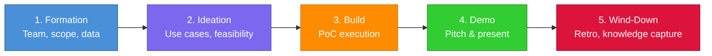

# Squad Hackathon Template

> A stamped-and-go template for running business hackathons — from ideation to PoC delivery — powered by a dispatched AI squad.

## What Is This?

This is a **hackathon template repo** dispatched from [squad-headquarters](https://github.com/sarahmoens/squad-headquarters). It provides structure, roles, and workflows for running a business hackathon (typically 1–3 days) with a customer or internal team.

The squad uses **Silicon Valley** characters as agent personas. The template is **tech-stack agnostic** — accelerator pattern packs (e.g., Fabric, Databricks, Azure AI) are pluggable and added per engagement.

## How to Use This Template

1. **Stamp a new repo** — Use this template to create a new repo for each hackathon engagement
2. **Add an accelerator pack** — Drop in a pattern pack for the relevant tech stack under `accelerators/`
3. **Configure customer context** — Update `.squad/team.md` Project Context with engagement-specific details
4. **Run the hackathon** — Follow the 5-stage lifecycle below

## Squad Roles

| Name | Role | What They Do |
|------|------|-------------|
| Jared | Facilitator | Runs the room, use case capture, time-boxing, scope gates |
| Gilfoyle | Architect | Technical feasibility, architecture sketch, build/no-build call |
| Richard | Builder | PoC execution — notebooks, pipelines, integrations |
| Dinesh | Data Wrangler | Data sourcing, cleaning, simulators, unblocks the Builder |
| Erlich | Demo Crafter | Pitch deck, demo narrative, storytelling, presentation coaching |
| Scribe | Session Logger | Continuous capture, engagement summary, knowledge flow to HQ |
| Ralph | Work Monitor | Monitors task queue, triage, dispatch |

## Hackathon Lifecycle



### Stage Details

| Stage | Duration | Key Activities | Lead |
|-------|----------|---------------|------|
| **1. Formation** | Pre-hackathon | Assemble team, prep data, set scope boundaries | Jared |
| **2. Ideation** | Day 1 morning | Use case brainstorming, feasibility scoring, scope gates | Jared + Gilfoyle |
| **3. Build** | Day 1 afternoon – Day 2 | PoC development, data wrangling, integration | Richard + Dinesh |
| **4. Demo** | Final session | Demo prep, pitch narrative, live presentation | Erlich |
| **5. Wind-Down** | Post-hackathon | Retrospective, knowledge capture, HQ sync | Jared + Scribe |

## Repository Structure

```
├── README.md                  # This file
├── .squad/                    # Squad configuration
│   ├── team.md                # Roster and operating rhythm
│   ├── routing.md             # Work routing rules
│   ├── ceremonies.md          # Hackathon ceremonies
│   ├── decisions.md           # Decision log
│   ├── casting/               # Agent identity management
│   ├── agents/                # Agent charters and history
│   ├── skills/                # Reusable patterns
│   └── log/                   # Activity log
├── accelerators/              # Pluggable tech-stack pattern packs
├── data/                      # Sample datasets and customer data staging
├── deliverables/              # PoC outputs, notebooks, pitch decks
└── docs/                      # Engagement-specific documentation
```

## Owner

**Sarah Moens** — Cloud Solution Architect at Microsoft Belgium
