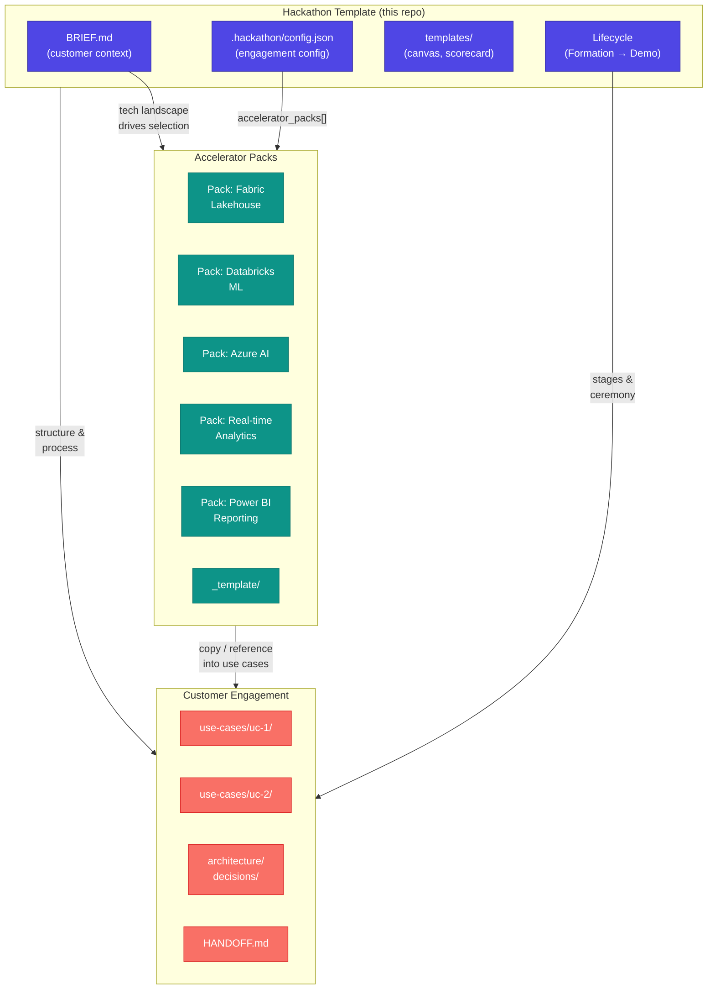
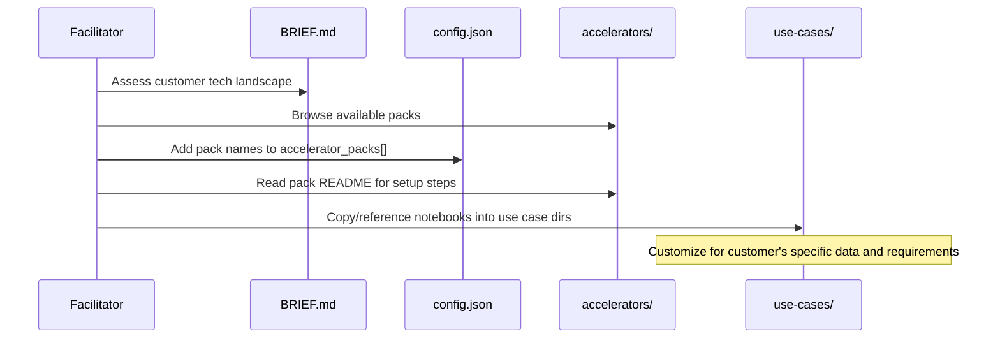
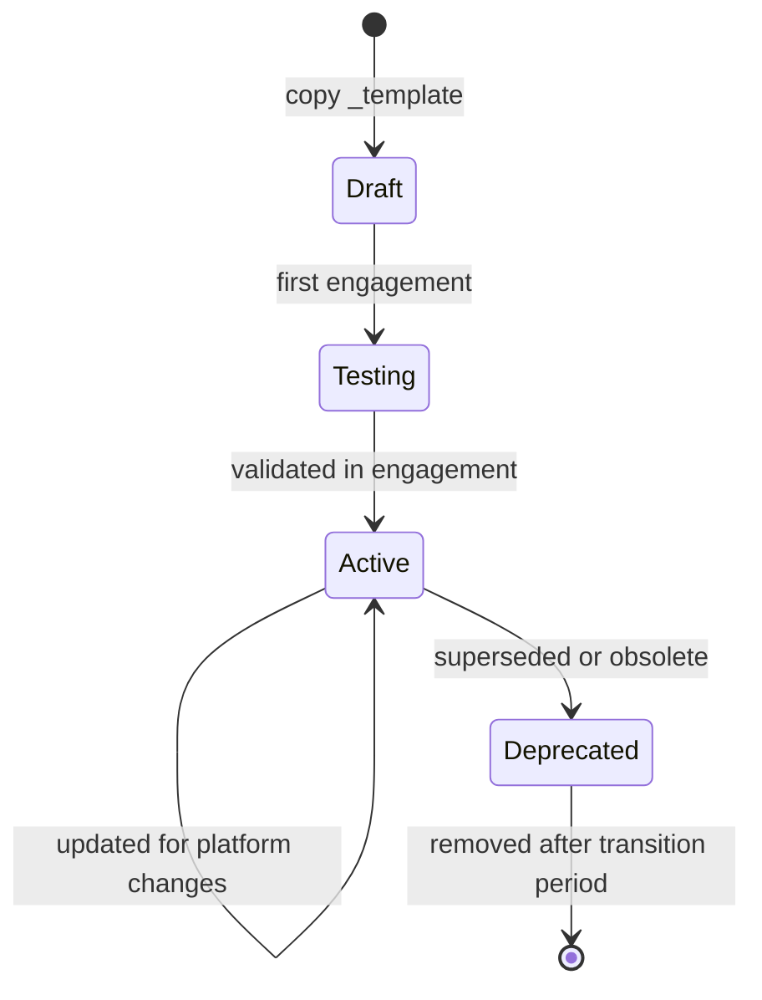

← [Concepts](./) | ← [README](../../README.md)

# Accelerator Architecture

Accelerator packs are **pluggable, tech-specific modules** that inject reference architectures, starter code, provisioning scripts, and sample data into a hackathon engagement. They exist so squads never start from scratch — every common pattern has a ready-made starting point.

---

## Why Accelerators Exist

Hackathons are time-boxed. Every hour spent on boilerplate setup is an hour not spent on solving the customer's actual problem. Accelerator packs solve this by pre-packaging:

- **Known-good architectures** — proven patterns that work
- **Starter code** — notebooks, scripts, and pipelines ready to customize
- **Sample data** — realistic datasets for when customer data isn't available
- **Provisioning** — infrastructure-as-code to spin up environments fast

The result: squads spend build time on the customer's unique problem, not on plumbing.

---

## Architecture Overview



**Key relationship:** The template provides structure and process. Packs provide technology. The engagement combines both for a specific customer.

---

## Pack Anatomy

Every accelerator pack follows a standard structure inside `accelerators/{pack-name}/`:

```
accelerators/{pack-name}/
├── README.md                  # Pack overview, setup instructions
├── reference-architecture.md  # Architecture diagram and decisions
├── notebooks/                 # Starter Jupyter/Fabric notebooks
│   ├── 01-data-ingestion.*
│   ├── 02-transformation.*
│   └── 03-output.*
├── scripts/                   # Automation and helper scripts
│   ├── provision.*
│   └── teardown.*
├── infra/                     # Infrastructure-as-code (Bicep/Terraform)
│   └── main.*
├── sample-data/               # Realistic sample datasets
│   └── README.md
└── docs/                      # Pack-specific documentation
    └── troubleshooting.md
```

### Component Breakdown

| Component | Purpose | Required? |
|-----------|---------|:---------:|
| `README.md` | Pack overview, prerequisites, setup steps | ✅ Yes |
| `reference-architecture.md` | Architecture diagram with component rationale | ✅ Yes |
| `notebooks/` | Starter notebooks, numbered by execution order | ✅ Yes |
| `scripts/` | Provisioning, teardown, and helper automation | 🟡 Recommended |
| `infra/` | Bicep or Terraform for environment setup | 🟡 Recommended |
| `sample-data/` | Datasets for when customer data isn't ready | 🟡 Recommended |
| `docs/` | Troubleshooting, known issues, advanced config | Optional |

---

## How Packs Compose with the Template

Packs are **not activated by default**. The composition flow:



**Step-by-step:**

1. **Assess** — During Formation, review the customer's tech stack in `BRIEF.md`
2. **Browse** — Check available packs in [`accelerators/README.md`](../../accelerators/README.md)
3. **Select** — Add chosen pack names to `.hackathon/config.json` → `accelerator_packs[]`
4. **Setup** — Follow the pack's `README.md` for provisioning and prerequisites
5. **Integrate** — Copy or reference pack notebooks/scripts into `use-cases/{name}/`
6. **Customize** — Adapt starter code to the customer's data, schema, and requirements

---

## Pack Selection Decision Framework

Use the [Feasibility Scorecard](../../templates/feasibility-scorecard.md) dimensions to guide pack selection:

| Scorecard Dimension | Pack Selection Question |
|--------------------|-----------------------|
| **Data Availability** | Does the pack support the customer's data source types? |
| **Data Quality** | Does the pack include transformation/cleaning notebooks? |
| **Integration Count** | Does the pack handle the required connectors? |
| **Model / Logic Complexity** | Does the pack include pre-built models or requires custom? |
| **Visualization Needs** | Does the pack include dashboard templates? |
| **Auth / Security** | Does the pack handle the customer's identity/network requirements? |

**Selection rules:**

- If customer uses Microsoft Fabric → start with a Fabric-based pack
- If ML/AI use cases dominate → select a pack with model training notebooks
- If real-time requirements exist → select a streaming/event-driven pack
- If the primary output is dashboards → ensure a reporting pack is included
- **Multiple packs can be combined** — e.g., Fabric Lakehouse + Power BI Reporting

---

## Example Pack Patterns

| Pack | Primary Use Case | Key Components | When to Use |
|------|-----------------|----------------|-------------|
| **Fabric Lakehouse** | Data engineering, medallion architecture | Lakehouse notebooks, Spark jobs, Delta tables | Customer has Fabric, structured data use cases |
| **Databricks ML** | Machine learning, model training | MLflow notebooks, feature engineering, model registry | Customer needs predictive analytics, has Databricks |
| **Azure AI** | Document intelligence, search, language | AI Services notebooks, prompt templates, search index setup | Customer wants document processing, chat, or search |
| **Real-time Analytics** | Streaming, event processing | Event Hub connectors, KQL queries, real-time dashboards | Customer needs live data processing |
| **Power BI Reporting** | Interactive dashboards, self-service BI | `.pbix` templates, DAX measures, semantic model | Primary output is executive dashboards or reports |

---

## Creating a New Pack

1. **Copy the template:** `accelerators/_template/` → `accelerators/{pack-name}/`
2. **Fill `README.md`:** Pack purpose, prerequisites, setup steps, known limitations
3. **Add reference architecture:** Mermaid diagram + component rationale in `reference-architecture.md`
4. **Build starter notebooks:** Number them by execution order (`01-`, `02-`, etc.)
5. **Add provisioning:** Scripts or IaC to spin up required infrastructure
6. **Include sample data:** Realistic datasets that work without customer data access
7. **Test in an engagement:** Run the pack in at least one real hackathon before promoting
8. **Register the pack:** Add an entry to the [Accelerator Packs table](../../accelerators/README.md)

### Quality Checklist for New Packs

| Requirement | Check |
|-------------|:-----:|
| README has clear prerequisites and setup steps | ☐ |
| Reference architecture diagram present | ☐ |
| Notebooks run end-to-end on sample data | ☐ |
| Provisioning script tested on a clean subscription | ☐ |
| Teardown script included (avoid orphaned resources) | ☐ |
| Tested in at least one real engagement | ☐ |
| Registered in accelerators/README.md | ☐ |

---

## Versioning and Maintenance

Accelerator packs evolve alongside the technologies they wrap. The maintenance model:

| Aspect | Approach |
|--------|----------|
| **Versioning** | Packs follow the template repo's versioning — no independent pack versions |
| **Updates** | When a platform releases breaking changes, update the affected pack's notebooks and infra |
| **Deprecation** | Mark a pack as `⚠️ Deprecated` in the table — don't delete it until all active engagements are complete |
| **Promotion** | New patterns discovered during [Wind-Down](../../RETRO.md) get extracted into new or existing packs |
| **Ownership** | Each pack has a listed maintainer in its `README.md` |
| **Testing** | Packs should be re-tested quarterly or when underlying services change significantly |

### Pack Lifecycle



---

## 📎 Related Documents

| Document | Purpose |
|----------|---------|
| [Hackathon Lifecycle](hackathon-lifecycle.md) | How packs fit into the 5-stage process |
| [Use-Case-Driven Development](use-case-driven-development.md) | Use cases drive pack selection |
| [Accelerator Packs README](../../accelerators/README.md) | Available packs and how to load them |
| [Feasibility Scorecard](../../templates/feasibility-scorecard.md) | Scoring framework that informs pack selection |
| [BRIEF.md](../../BRIEF.md) | Customer tech landscape that drives selection |
