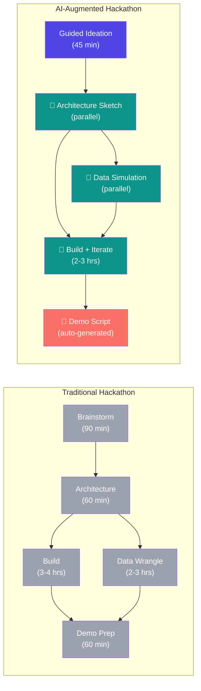
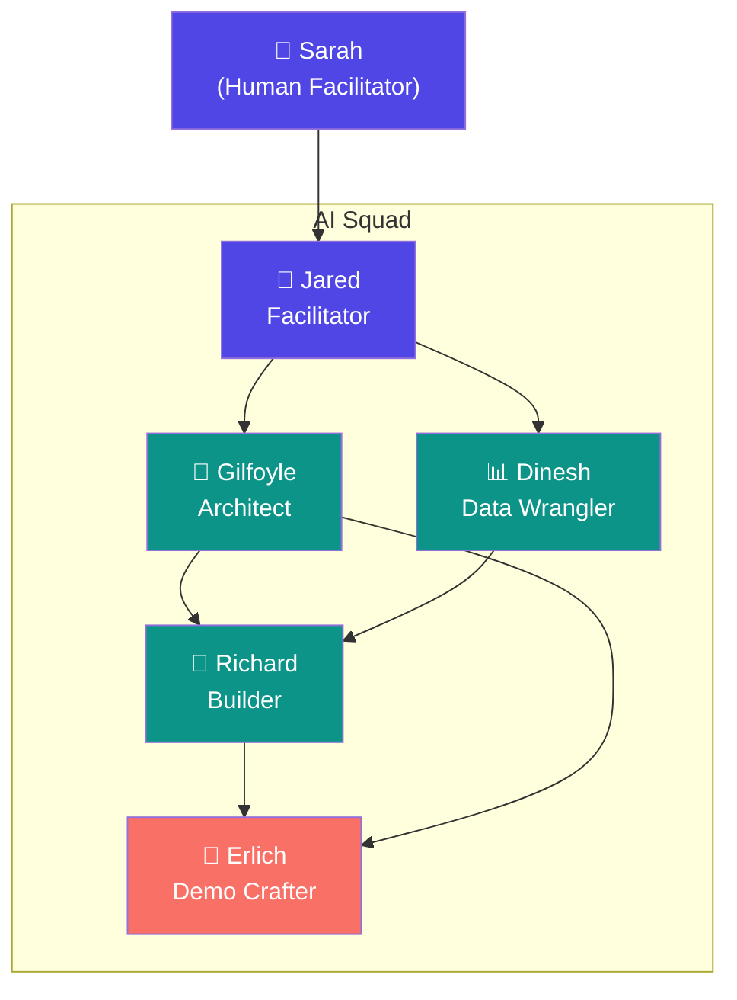
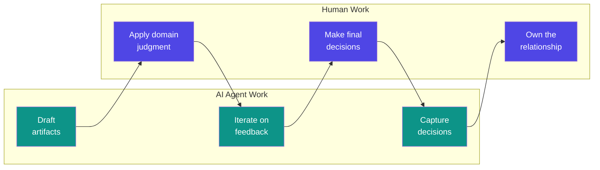

# AI-Augmented Hackathons

**Category:** Concept  
**Audience:** Facilitators, Squad Operators, Customer-Facing Teams  
**Related:** [industry-tailoring](industry-tailoring.md) · [hackathon-lifecycle](hackathon-lifecycle.md) · [use-case-prioritization](use-case-prioritization.md)

---

## What Is an AI-Augmented Hackathon?

An AI-augmented hackathon is a business hackathon where an **AI agent team works alongside human participants** to accelerate every phase — from ideation through live demo. Instead of a room full of people context-switching between brainstorming, architecture, coding, data prep, and presentation, the AI squad handles structured execution tasks while humans focus on **domain judgment, creativity, and stakeholder alignment**.

The result: **3-5x more polished output in the same time**, with artifacts that are production-traceable rather than scratch-pad quality.

---

## Traditional vs. AI-Augmented

### Side-by-Side Comparison

| Dimension | Traditional | AI-Augmented | Improvement |
|-----------|------------|--------------|-------------|
| **Ideation → Prioritized Use Cases** | 90 min (open brainstorm) | 45 min (industry-seeded, guided) | ~50% faster |
| **Architecture Decision** | 60 min (whiteboard, debate) | 20 min (AI draft → human review) | ~65% faster |
| **Data Preparation** | 2-3 hrs (manual wrangling) | 30 min (synthetic generator + auto-profiling) | ~80% faster |
| **PoC Build** | 3-4 hrs (from scratch) | 2-3 hrs (scaffolded, iterated) | ~30% faster |
| **Demo Preparation** | 60 min (last-minute scramble) | 20 min (auto-drafted script + dry run) | ~65% faster |
| **Documentation** | Rarely done / post-hoc | Continuous (auto-generated artifacts) | ∞ improvement |
| **Deliverable Quality** | Scrappy prototype | Structured PoC with architecture, data, and narrative | Significantly higher |
| **Knowledge Retention** | Mostly lost | Captured in repo (decisions, logs, retro) | Persistent |

---

## The Squad AI Team

The hackathon template uses five specialized AI agents, each mapped to a distinct role in the hackathon lifecycle. The key insight: **specialization beats generalism**. Each agent has a focused charter, knows its boundaries, and defers to others for out-of-scope work.

### Role-by-Role Breakdown

#### 🎯 Jared — Facilitator

**What Jared does:**
- Captures and structures use case ideas from brainstorming into standardized canvases
- Time-boxes sessions and enforces scope boundaries
- Produces the use case brief with business context, success metrics, and feasibility questions
- Manages the decision inbox and escalation flow

**What Jared produces:**
- Populated [use-case-canvas](../../templates/use-case-canvas.md) for each idea
- Prioritized backlog with feasibility scores
- Session summaries and decision logs

**Human collaboration:** Jared proposes structure, but the **human facilitator makes the final call** on which use cases advance. Jared cannot judge political dynamics, customer enthusiasm, or "the vibe in the room."

---

#### 🧠 Gilfoyle — Architect

**What Gilfoyle does:**
- Evaluates technical feasibility of each use case against available infrastructure, data, and time
- Produces architecture sketches (Mermaid diagrams + component descriptions)
- Makes build/no-build recommendations with rationale
- Writes Architecture Decision Records (ADRs) for key choices

**What Gilfoyle produces:**
- [Feasibility scorecards](../../templates/feasibility-scorecard.md) per use case
- Architecture diagram (Lakehouse, pipeline, model, dashboard topology)
- ADRs in [architecture/decisions/](../../architecture/decisions/)
- Technology selection rationale

**Human collaboration:** Gilfoyle provides the **technical assessment**, but the human architect applies **customer-specific constraints** (existing investments, team skills, political preferences for specific tools).

---

#### 🔧 Richard — Builder

**What Richard does:**
- Implements the PoC based on Gilfoyle's architecture — notebooks, pipelines, dashboards
- Iterates rapidly with human feedback (builds, shows, adjusts)
- Scaffolds infrastructure code (Fabric Lakehouse setup, notebook templates)
- Produces working, runnable artifacts (not just pseudocode)

**What Richard produces:**
- Fabric/Databricks notebooks with documented cells
- Data pipeline definitions
- Power BI report files or embedded visualizations
- Infrastructure-as-code fragments

**Human collaboration:** Richard builds fast but needs **human judgment on edge cases**, data interpretation, and "is this what the customer actually wants?" Course corrections come from the human builder and architect.

---

#### 📊 Dinesh — Data Wrangler

**What Dinesh does:**
- Sources, profiles, and prepares data for the PoC
- Builds synthetic data generators when real data isn't available
- Handles schema mapping, type casting, and quality checks
- Serves clean data to Richard in the format the build needs

**What Dinesh produces:**
- Data profiling reports (row counts, distributions, nulls, anomalies)
- Synthetic data generators (Python scripts producing realistic CSVs/Parquet)
- Cleaned/transformed datasets ready for analysis
- Data dictionaries and lineage documentation

**Human collaboration:** Dinesh handles the mechanics, but the **human data wrangler validates domain correctness** — does this synthetic sensor data look like real vibration data? Are the value ranges plausible?

---

#### 🎤 Erlich — Demo Crafter

**What Erlich does:**
- Crafts the demo narrative — the story that turns a PoC into a compelling pitch
- Writes the demo script ([demo-script-template](../../templates/demo-script-template.md))
- Structures the walkthrough flow: problem → data → solution → impact
- Coaches on presentation timing and audience engagement

**What Erlich produces:**
- Demo script with speaker notes and timing marks
- Slide talking points or narrative outline
- HANDOFF.md summary for post-hackathon delivery
- "So what?" framing — connects technical output to business value

**Human collaboration:** Erlich drafts the narrative, but the **human presenter owns the delivery**. Erlich cannot read the room, adjust to live questions, or project confidence — that's the human's job.

---

## The Human-AI Collaboration Model

The Squad operates on a principle of **AI drafts, human decides**. This is not automation — it's augmentation.

### What Stays Human

| Capability | Why It Stays Human |
|-----------|-------------------|
| **Stakeholder reading** | AI can't sense energy, hesitation, or political undercurrents |
| **Domain validation** | Only the customer knows if a data pattern is realistic |
| **Scope negotiation** | Knowing when to push back or extend requires relationship judgment |
| **Demo delivery** | Presence, eye contact, improvisation — irreplaceably human |
| **Go/no-go decisions** | Accountability requires a human in the loop |

### What AI Excels At

| Capability | Why AI Wins |
|-----------|------------|
| **Structured artifact generation** | Consistent, complete, fast — no fatigue |
| **Parallel execution** | Data prep, architecture, and scaffolding happen simultaneously |
| **Pattern recognition** | Cross-industry use case matching from the [catalog](industry-tailoring.md) |
| **Documentation** | Continuous capture vs. post-hoc scramble |
| **Iteration speed** | Full rebuild in minutes vs. hours |

---

## When to Use AI Augmentation

### Strong Fit ✅

- **Time-constrained hackathons** (1-2 days) where speed-to-demo is critical
- **Broad exploratory sessions** where 3-5 use cases need rapid feasibility assessment
- **Repeatable formats** (customer-facing advisory hackathons with similar structure)
- **Data-scarce scenarios** where synthetic data generation is needed
- **Documentation-conscious organizations** that want structured deliverables, not just memories

### Weak Fit ⚠️

- **Deep R&D hackathons** where the challenge is algorithmic novelty, not execution speed
- **Hands-on skill-building** events where participants need to learn by doing, not watching
- **Politically sensitive engagements** where AI involvement might alienate stakeholders
- **Highly regulated contexts** where all artifacts need human attestation and AI use requires disclosure

### Anti-Patterns 🚫

- Using AI as a **replacement** for human facilitators (participants feel unheard)
- Letting AI **choose the use case** without customer input (solutions looking for problems)
- Over-polishing the demo to hide **thin substance** (AI makes it easy to fake depth)
- Skipping the **human review loop** (AI confidently produces wrong architecture for the customer's context)

---

## What the AI Team Actually Produces

A complete AI-augmented hackathon generates these artifacts in the repository:

| Artifact | Created By | Location |
|----------|-----------|----------|
| Use case canvases (2-4) | Jared | `use-cases/*.md` |
| Feasibility scorecards | Gilfoyle | `use-cases/*.md` (section) |
| Architecture diagram | Gilfoyle | `architecture/` |
| Architecture decisions | Gilfoyle | `architecture/decisions/ADR-*.md` |
| Data profiling report | Dinesh | `data/` |
| Synthetic data scripts | Dinesh | `data/simulators/` |
| PoC notebooks/code | Richard | `accelerators/` or top-level |
| Demo script | Erlich | `templates/demo-script.md` |
| Handoff document | Erlich + team | `HANDOFF.md` |
| Decision log | All | `.hackathon/decisions/` |
| Retrospective | Jared | `RETRO.md` |

### Example: Manufacturing Predictive Maintenance Hackathon

> A 1-day hackathon for a steel manufacturer. The AI squad produces:
>
> 1. **Jared** captures 4 use case ideas, structures them into canvases, and facilitates prioritization down to 2 (predictive maintenance + OEE dashboard)
> 2. **Gilfoyle** sketches a Fabric Lakehouse architecture with Event Hubs ingestion, Delta tables, and Power BI DirectLake — writes ADR-001 explaining why Lakehouse over Warehouse
> 3. **Dinesh** generates 6 months of synthetic vibration sensor data with planted failure signatures, profiles it, and serves it as a Delta table
> 4. **Richard** builds a Fabric notebook with the ML pipeline (feature engineering → model training → scoring), plus a second notebook for the OEE calculation
> 5. **Erlich** writes the demo script: _"Imagine it's 3 AM and Line 4 is about to fail..."_ — complete with speaker notes and timing for a 10-minute pitch

All artifacts live in the repo. Nothing is on a whiteboard that gets erased.

---

## Getting Started

1. **Read the [hackathon lifecycle](hackathon-lifecycle.md)** to understand the phases
2. **Pick an [industry profile](industry-tailoring.md)** for your engagement
3. **Configure the squad** in [`.squad/team.md`](../../.squad/team.md)
4. **Fill the [BRIEF.md](../../BRIEF.md)** with customer context
5. **Let the squad work** — Jared kicks off, the rest follow their charters

The humans set direction. The AI accelerates execution. The repo captures everything.

---

*Last updated: 2025-03-31*
