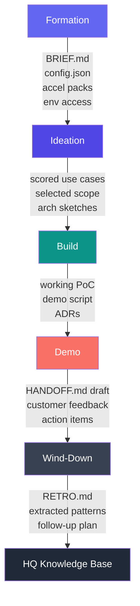

← [Concepts](./) | ← [README](../../README.md)

# Hackathon Lifecycle

The hackathon lifecycle is a **5-stage process** that takes a customer engagement from blank canvas to live demo and captured knowledge. Each stage has clear inputs, outputs, decision gates, and time-boxes — designed to compress months of exploration into one or two focused days.

---

## Lifecycle Overview

```mermaid
---
config:
  theme: base
  themeVariables:
    primaryColor: "#4F46E5"
    lineColor: "#9CA3AF"
    primaryTextColor: "#fff"
---
flowchart LR
    subgraph PRE ["Pre-Hackathon"]
        A(["① Formation"]):::prep
    end

    subgraph DAY ["Hackathon Day(s)"]
        B(["② Ideation"]):::ideate
        C(["③ Build"]):::build
        D(["④ Demo"]):::demo
    end

    subgraph POST ["Post-Hackathon"]
        E(["⑤ Wind-Down"]):::wrap
    end

    A -- "BRIEF.md\nconfig.json" --> B
    B -- "scored use cases\nselected scope" --> C
    C -- "working PoC\ndemo script" --> D
    D -- "HANDOFF.md\ndeliverables" --> E

    classDef prep fill:#6366F1,stroke:#4F46E5,color:#fff,rx:20
    classDef ideate fill:#4F46E5,stroke:#3730A3,color:#fff,rx:20
    classDef build fill:#0D9488,stroke:#0F766E,color:#fff,rx:20
    classDef demo fill:#F97066,stroke:#DC2626,color:#fff,rx:20
    classDef wrap fill:#374151,stroke:#1F2937,color:#fff,rx:20

    linkStyle default stroke:#9CA3AF,stroke-width:2px
```

---

## Stage Details

### ① Formation

| Attribute | Detail |
|-----------|--------|
| **When** | T-14 to T-1 (pre-hackathon) |
| **Purpose** | Assemble the squad, understand the customer, prepare data and infrastructure |
| **Who leads** | Facilitator + Architect |
| **Duration** | 1–2 weeks of async prep |

**Key activities:**

- Fill [`BRIEF.md`](../../BRIEF.md) — customer context, goals, tech landscape, constraints
- Configure [`.hackathon/config.json`](../../.hackathon/config.json) — engagement settings
- Select [accelerator packs](../../accelerators/README.md) based on customer tech stack
- Provision environments (Azure subscriptions, Fabric workspaces, service principals)
- Secure sample data or confirm customer data access
- Run through [Formation Checklist](../../.hackathon/checklist-formation.md)
- Brief the squad on customer context and pre-identified hypotheses

**Inputs → Outputs:**

| Inputs | Outputs |
|--------|---------|
| Customer request / sales lead | Completed `BRIEF.md` |
| Customer tech landscape | Selected accelerator packs |
| Squad roster | Configured `config.json` |
| Raw data access details | Provisioned environments |

**Decision gate:** *"Do we have enough data access, clear goals, and working infrastructure to start?"* — If no, defer or descope before day 1.

**Anti-patterns:**

| Anti-pattern | Why it hurts | Fix |
|-------------|-------------|-----|
| Skipping the brief | Squad arrives blind, wastes ideation on context-gathering | Block formation until BRIEF.md is complete |
| No data access confirmed | Build phase stalls on permissions and firewall rules | Require a data access test at T-3 minimum |
| Over-scoping hypotheses | Customer expects 10 PoCs, squad delivers 0 | Cap pre-identified hypotheses at 3–5 |
| No environment provisioned | First 2 hours lost to setup | Demand working infra at T-1 go/no-go |

---

### ② Ideation

| Attribute | Detail |
|-----------|--------|
| **When** | Day 1, first session (morning) |
| **Purpose** | Surface use cases from the business, score feasibility, select what to build |
| **Who leads** | Facilitator |
| **Duration** | 2–3 hours |

**Key activities:**

- Brainstorm use cases with the customer (divergent thinking)
- Fill a [Use Case Canvas](../../templates/use-case-canvas.md) per candidate
- Score each candidate with the [Feasibility Scorecard](../../templates/feasibility-scorecard.md)
- Vote and select 1–3 use cases to build
- Define the "demo-able slice" for each selected use case
- Architect sketches the solution approach for selected use cases

**Inputs → Outputs:**

| Inputs | Outputs |
|--------|---------|
| Completed `BRIEF.md` | Filled Use Case Canvases |
| Customer domain knowledge | Scored feasibility cards |
| Accelerator pack options | Selected use cases (1–3) |
| Pre-identified hypotheses | Architecture sketches |

**Decision gate:** *"Can we build a demo-able slice of each selected use case in the remaining time?"* — If a use case scores 🔴 Redirect, drop it now.

**Anti-patterns:**

| Anti-pattern | Why it hurts | Fix |
|-------------|-------------|-----|
| Technology-first brainstorming | "Let's use AI!" produces solutions looking for problems | Force problem-statement-first format on every canvas |
| Skipping feasibility scoring | The cool use case turns out to need data that doesn't exist | Score before committing — no exceptions |
| Selecting too many use cases | 3 half-built PoCs beats 0 complete ones | Hard limit: 1 for 1-day, 2–3 for 2-day |
| Architect not in the room | Selected use cases are technically impossible | Architect must attend and provide real-time feasibility input |

---

### ③ Build

| Attribute | Detail |
|-----------|--------|
| **When** | Day 1 afternoon through Day 2 (or Day 1 afternoon for 1-day format) |
| **Purpose** | Implement working PoC(s) for selected use cases |
| **Who leads** | Architect + Builder |
| **Duration** | 4–8 hours |

**Key activities:**

- Builder and Data Wrangler execute on the architecture sketch
- Data Wrangler preps, cleans, and connects data sources
- Builder develops notebooks, pipelines, dashboards
- Architect makes build/no-build calls and handles blockers
- Demo Crafter starts preparing narrative and demo script
- Record [architecture decisions](../../architecture/decisions/_template.md) for non-obvious choices
- Mid-build checkpoint: "Are we still on track for a demo-able slice?"

**Inputs → Outputs:**

| Inputs | Outputs |
|--------|---------|
| Selected use cases with arch sketch | Working PoC code (notebooks, scripts) |
| Accelerator pack resources | Connected data pipelines |
| Provisioned environments | Draft demo script |
| Customer data / sample data | Architecture decision records |

**Decision gate:** *Mid-build checkpoint — "Can we demo this? If not, what do we cut?"* Scope cuts happen here, not during demo.

**Anti-patterns:**

| Anti-pattern | Why it hurts | Fix |
|-------------|-------------|-----|
| Boiling the ocean | Trying to build production-grade code in a hackathon | Focus on the demo-able slice, not the full solution |
| No mid-build checkpoint | Team realizes at hour 7 that demo is impossible | Mandatory check at the midpoint — cut or pivot |
| Siloed work | Builder and Data Wrangler don't sync, integration fails | Co-locate, pair when needed, 30-min standup cycles |
| Ignoring the demo | Beautiful code that nobody can explain | Demo Crafter must start narrative at build start |

---

### ④ Demo

| Attribute | Detail |
|-----------|--------|
| **When** | Final session (last 1–2 hours) |
| **Purpose** | Present working solution to customer stakeholders, tell the value story |
| **Who leads** | Demo Crafter + Facilitator |
| **Duration** | 1–2 hours |

**Key activities:**

- Run through demo script (rehearse if time permits)
- Present each use case: problem → solution → live demo → business value
- Capture customer reactions, questions, and energy level
- Discuss next steps and productionization path
- Begin filling [`HANDOFF.md`](../../HANDOFF.md)

**Inputs → Outputs:**

| Inputs | Outputs |
|--------|---------|
| Working PoC(s) | Customer reactions / satisfaction signal |
| Demo script | Completed `HANDOFF.md` (draft) |
| Architecture decisions | Follow-up action items |
| Customer stakeholder audience | Productionization roadmap sketch |

**Decision gate:** *"Did the customer see value? Is there a path to production?"* — This determines follow-up engagement likelihood.

**Anti-patterns:**

| Anti-pattern | Why it hurts | Fix |
|-------------|-------------|-----|
| Code walkthrough instead of demo | Customer sees syntax, not value | Lead with the business outcome, show the result first |
| No narrative | Disconnected feature showcase | Use the [demo script template](../../templates/demo-script-template.md) |
| Demoing broken features | Erodes trust instantly | Only demo what works — cut the rest from the script |
| Skipping next steps | Customer excitement evaporates without a path forward | Always end with concrete follow-up actions |

---

### ⑤ Wind-Down

| Attribute | Detail |
|-----------|--------|
| **When** | T+0 to T+5 (post-hackathon) |
| **Purpose** | Capture knowledge, extract reusable patterns, close the engagement cleanly |
| **Who leads** | Facilitator + whole squad |
| **Duration** | 2–5 days (async) |

**Key activities:**

- Complete [`HANDOFF.md`](../../HANDOFF.md) with final details
- Run retrospective and fill [`RETRO.md`](../../RETRO.md)
- Extract reusable patterns and code accelerators
- Run [Knowledge Extraction Checklist](../../.hackathon/checklist-knowledge-extract.md)
- Run [Wind-Down Checklist](../../.hackathon/checklist-winddown.md)
- Promote patterns to HQ knowledge base or accelerator library
- Clean up environments (or hand over to customer)

**Inputs → Outputs:**

| Inputs | Outputs |
|--------|---------|
| Demo results and customer feedback | Final `HANDOFF.md` |
| Build artifacts and decisions | Completed `RETRO.md` |
| Patterns discovered during build | Extracted accelerator candidates |
| Customer satisfaction signal | Follow-up engagement plan |

**Decision gate:** *"Have we captured everything reusable? Is the knowledge extraction checklist complete?"*

**Anti-patterns:**

| Anti-pattern | Why it hurts | Fix |
|-------------|-------------|-----|
| Skipping the retro | Same mistakes repeated next hackathon | Schedule it before people disperse — T+1 at latest |
| Not extracting patterns | Valuable code rots in a one-off repo | Use the knowledge extraction checklist religiously |
| Orphaned environments | Azure costs keep running, security risk | Wind-down checklist includes environment cleanup |
| No customer follow-up | Warm lead goes cold | Facilitator owns follow-up within T+5 |

---

## Inter-Stage Handoff Map

| From → To | Artifact | Purpose |
|-----------|----------|---------|
| Formation → Ideation | `BRIEF.md`, `config.json`, selected accelerators | Squad context and infrastructure readiness |
| Ideation → Build | Scored use cases, architecture sketches | What to build and how |
| Build → Demo | Working PoC, demo script, ADRs | What to show and what decisions were made |
| Demo → Wind-Down | `HANDOFF.md` draft, customer feedback | What to document and extract |
| Wind-Down → HQ | `RETRO.md`, extracted patterns, follow-up plan | Organizational learning |

---

## Time-Box Formats

### 1-Day Format (6–8 hours)

| Time | Stage | Duration |
|------|-------|----------|
| 09:00 – 09:30 | Kick-off & context | 30 min |
| 09:30 – 11:30 | ② Ideation | 2 hrs |
| 11:30 – 12:00 | Scope lock & lunch order | 30 min |
| 12:00 – 16:00 | ③ Build (with working lunch) | 4 hrs |
| 16:00 – 17:00 | ④ Demo + next steps | 1 hr |

**Constraint:** Select a single use case. No room for scope creep.

### 2-Day Format (12–16 hours)

| Time | Stage | Duration |
|------|-------|----------|
| **Day 1** 09:00 – 09:30 | Kick-off & context | 30 min |
| **Day 1** 09:30 – 12:00 | ② Ideation | 2.5 hrs |
| **Day 1** 12:00 – 12:30 | Scope lock | 30 min |
| **Day 1** 13:00 – 17:00 | ③ Build (session 1) | 4 hrs |
| **Day 2** 09:00 – 09:30 | Standup + re-align | 30 min |
| **Day 2** 09:30 – 14:00 | ③ Build (session 2) | 4.5 hrs |
| **Day 2** 14:00 – 15:00 | Demo prep & rehearsal | 1 hr |
| **Day 2** 15:00 – 16:30 | ④ Demo + next steps | 1.5 hrs |

**Advantage:** 2–3 use cases feasible. Day 2 morning allows course correction.

---

## Stage × Role × Responsibility Matrix

| Stage | Facilitator | Architect | Builder | Data Wrangler | Demo Crafter |
|-------|:-----------:|:---------:|:-------:|:-------------:|:------------:|
| **Formation** | Lead brief, schedule | Assess feasibility, select packs | Prep tooling | Confirm data access | Review customer context |
| **Ideation** | **Run session**, time-box | Score feasibility | Estimate effort | Assess data readiness | Capture narrative seeds |
| **Build** | Remove blockers, check progress | **Design**, make build/no-build calls | **Execute**, write code | **Prep data**, connect sources | Start demo script |
| **Demo** | MC the session, manage Q&A | Explain architecture | Support live demo | Handle data questions | **Lead presentation** |
| **Wind-Down** | **Run retro**, manage follow-up | Document ADRs | Extract reusable code | Document data pipelines | Finalize HANDOFF.md |

**Bold** = primary owner for that stage.

---

## 📎 Related Documents

| Document | Purpose |
|----------|---------|
| [Accelerator Architecture](accelerator-architecture.md) | How accelerator packs plug into the lifecycle |
| [Use-Case-Driven Development](use-case-driven-development.md) | The methodology behind ideation and scoping |
| [BRIEF.md](../../BRIEF.md) | Formation-phase intake form |
| [HANDOFF.md](../../HANDOFF.md) | Demo-phase deliverable |
| [RETRO.md](../../RETRO.md) | Wind-down retrospective |
