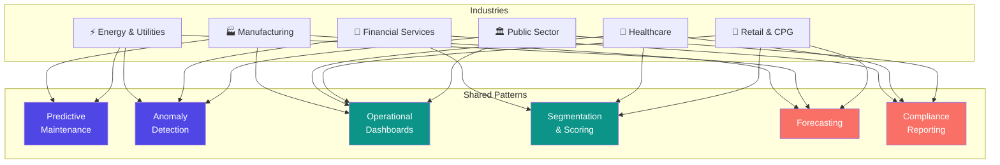

# Industry Tailoring: A Hackathon Opportunity Catalog

**Category:** Concept  
**Audience:** Facilitators, Solution Architects, Account Teams  
**Related:** [ai-augmented-hackathons](ai-augmented-hackathons.md) · [hackathon-lifecycle](hackathon-lifecycle.md) · [use-case-prioritization](use-case-prioritization.md)

---

## What Is Industry Tailoring?

Industry tailoring is the practice of **pre-loading a hackathon with domain-specific context** — personas, use case patterns, data shapes, and technology sweet spots — so that teams skip the "blank page" phase and start building from informed starting points.

A generic hackathon says _"What should we build?"_  
A tailored hackathon says _"Here are the 5 things your industry typically needs — which resonates?"_

This dramatically compresses the ideation phase and produces use cases that are grounded in real operational pain, not hypothetical exercises.

---

## How It Connects

```mermaid
graph LR
    subgraph Preparation
        I["🏭 Industry Profile"]
        P["👤 Key Personas"]
        UC["📋 Use Case Patterns"]
    end

    subgraph Tailoring
        D["📊 Data Characteristics"]
        T["☁️ Tech Sweet Spots"]
        A["⚡ Accelerator Pack"]
    end

    subgraph Execution
        B["🔨 Build Phase"]
        Demo["🎤 Demo"]
    end

    I --> P --> UC
    UC --> D --> T --> A
    A --> B --> Demo

    style I fill:#4F46E5,color:#fff
    style P fill:#4F46E5,color:#fff
    style UC fill:#4F46E5,color:#fff
    style D fill:#0D9488,color:#fff
    style T fill:#0D9488,color:#fff
    style A fill:#0D9488,color:#fff
    style B fill:#F97066,color:#fff
    style Demo fill:#F97066,color:#fff
```

The industry profile feeds directly into the [BRIEF.md](../../BRIEF.md) and helps Jared (Facilitator) structure the opening session. Gilfoyle (Architect) uses the tech sweet spots to fast-track feasibility scoring. Dinesh (Data Wrangler) uses data characteristics to prepare simulators before day one.

---

## Industry Catalog

### Legend

| Badge | Meaning |
|-------|---------|
| 🟢 | High feasibility — achievable in a 1-day hackathon with sample data |
| 🟡 | Medium feasibility — achievable with preparation or simplification |
| 🔴 | Low feasibility — requires real data access or extended timeline |

---

## 🏭 Manufacturing

> Sarah's primary domain. Deep coverage with proven patterns.

### Personas at the Table

| Persona | Typical Title | What They Care About |
|---------|---------------|----------------------|
| **Plant Manager** | VP Operations, Plant Director | OEE, downtime reduction, cost per unit |
| **Quality Engineer** | Quality Manager, QA Lead | Defect rates, SPC, root cause analysis |
| **Maintenance Lead** | Reliability Engineer, Maintenance Mgr | Predictive maintenance, spare parts, MTBF/MTTR |
| **Supply Chain Planner** | S&OP Manager, Logistics Lead | Demand visibility, lead times, inventory buffers |
| **Energy Manager** | Sustainability Lead, Utilities Mgr | kWh per unit, peak shaving, carbon reporting |
| **Data/IT Lead** | OT/IT Convergence Lead, Data Engineer | Historian integration, edge-to-cloud, data quality |

### Use Case Patterns

| # | Use Case | Description | Feasibility | Data Needed |
|---|----------|-------------|:-----------:|-------------|
| 1 | **Predictive Maintenance** | ML models on vibration, temperature, and pressure sensor data to predict equipment failure before it happens. Reduces unplanned downtime 20-40%. | 🟢 | Sensor telemetry (historian exports), maintenance work orders |
| 2 | **Quality Control & Defect Detection** | Statistical process control dashboards + anomaly detection on production parameters. Correlate input variables to output defects. | 🟢 | Production logs, inspection results, process parameters |
| 3 | **OEE Dashboard** | Real-time Overall Equipment Effectiveness (Availability × Performance × Quality) with drill-down by line, shift, and product. | 🟢 | Machine state data, production counts, quality logs |
| 4 | **Supply Chain Visibility** | End-to-end tracking from raw materials to finished goods with bottleneck detection and lead-time forecasting. | 🟡 | ERP extracts, supplier data, logistics timestamps |
| 5 | **Energy Optimization** | Correlate energy consumption with production schedules to identify waste, model peak-shaving strategies, and forecast carbon footprint. | 🟡 | Smart meter data, production schedules, utility bills |

### Data Characteristics

- **Formats:** Time-series from historians (OSIsoft PI, Kepware), CSV/Parquet exports, ERP flat files (SAP, Dynamics)
- **Volume:** Sensor data can be millions of rows/day per plant; ERP data is typically batch/daily
- **Challenges:** OT/IT gap (historian data locked behind firewalls), inconsistent naming, missing timestamps, multi-timezone plants
- **Simulator approach:** Generate synthetic sensor data with known failure signatures — Dinesh's specialty

### Azure/Fabric Sweet Spots

| Technology | Application |
|-----------|-------------|
| **Microsoft Fabric Lakehouse** | Unify historian exports, ERP data, and IoT streams in Delta tables |
| **Fabric Real-Time Intelligence** | Stream processing for sensor telemetry and alerts |
| **Azure IoT Hub / Event Hubs** | Ingest from edge gateways and historians |
| **Power BI (DirectLake)** | OEE dashboards with sub-second refresh on Lakehouse |
| **Azure ML / Fabric Data Science** | Predictive maintenance models (scikit-learn, AutoML) |
| **Databricks** | Complex ML pipelines, MLflow model registry |

### Hackathon Tips

- Always bring a **synthetic data generator** — real plant data rarely clears compliance in time
- Focus on **one production line** for the PoC, not the whole factory
- OEE is the universal language — even if the use case isn't OEE, frame impact in OEE terms
- Plant managers respond to **"time saved" and "dollars recovered"**, not technical metrics

---

## 🏦 Financial Services

> Sarah's secondary domain. Strong patterns around risk, fraud, and regulatory compliance.

### Personas at the Table

| Persona | Typical Title | What They Care About |
|---------|---------------|----------------------|
| **Risk Manager** | CRO, Risk Analytics Lead | Exposure, VaR, stress testing, model governance |
| **Compliance Officer** | Head of Compliance, RegTech Lead | Regulatory reporting (IFRS, Basel), audit trails |
| **Fraud Analyst** | Fraud Operations Manager | Detection rates, false positives, investigation time |
| **Wealth/Relationship Mgr** | Advisor, Portfolio Manager | Client 360 view, next-best-action, AUM retention |
| **Data Governance Lead** | CDO, Data Steward | Lineage, classification, PII handling |

### Use Case Patterns

| # | Use Case | Description | Feasibility | Data Needed |
|---|----------|-------------|:-----------:|-------------|
| 1 | **Fraud Detection** | Real-time transaction scoring using ML to flag anomalous patterns. Reduce false positives while catching more true fraud. | 🟡 | Transaction logs (anonymized), customer profiles, historical fraud labels |
| 2 | **Regulatory Reporting Automation** | Automate data aggregation and report generation for IFRS 9, Basel III/IV, or local regulatory frameworks. | 🟡 | General ledger extracts, loan portfolios, risk parameters |
| 3 | **Customer 360** | Unify data from CRM, transactions, digital channels, and call center into a single client view with propensity scoring. | 🟢 | CRM exports, transaction summaries, digital engagement logs |
| 4 | **Risk Analytics & Stress Testing** | Portfolio risk modeling with scenario simulation. What-if analysis on interest rate shifts, credit defaults. | 🔴 | Portfolio positions, market data feeds, historical defaults |
| 5 | **AML Transaction Monitoring** | Pattern detection on wire transfers and account activity to surface suspicious behavior for investigation. | 🔴 | Wire transfer logs, account activity, sanctions lists |

### Data Characteristics

- **Formats:** Structured relational data (SQL exports), CSV, sometimes XML for regulatory filings
- **Volume:** Transaction volumes vary wildly — retail banks generate millions/day
- **Challenges:** PII everywhere (anonymization required), regulatory restrictions on cloud hosting, legacy mainframe sources
- **Simulator approach:** Synthetic transaction generators with planted fraud/anomaly patterns

### Azure/Fabric Sweet Spots

| Technology | Application |
|-----------|-------------|
| **Microsoft Fabric Lakehouse** | Unified analytics layer across risk, fraud, and customer data |
| **Azure Synapse / Fabric Warehouse** | Regulatory reporting aggregations and historical analysis |
| **Azure Machine Learning** | Fraud scoring models, credit risk models |
| **Power BI** | Risk dashboards, compliance scorecards, client 360 views |
| **Microsoft Purview** | Data governance, lineage, sensitivity labeling |
| **Azure Confidential Computing** | Processing sensitive data in secure enclaves |

### Hackathon Tips

- **Data sensitivity is the #1 blocker** — have anonymization/synthetic strategy ready before day one
- Focus on **one product line** (e.g., credit cards for fraud, mortgage book for risk)
- Compliance officers want to see **audit trails and lineage**, not just dashboards
- Frame ROI in **false-positive reduction** (fraud) or **person-hours saved** (regulatory)

---

## 🏥 Healthcare

### Personas at the Table

| Persona | Typical Title | What They Care About |
|---------|---------------|----------------------|
| **Clinical Director** | CMO, Chief Medical Officer | Patient outcomes, care quality metrics |
| **Operations Manager** | COO, Hospital Administrator | Bed utilization, patient flow, wait times |
| **Health Informaticist** | CMIO, Clinical Informatics Director | EHR optimization, clinical decision support |
| **Population Health Manager** | VP Population Health | Risk stratification, chronic disease management |
| **IT/Data Lead** | CTO, Health IT Director | FHIR/HL7 integration, data interoperability |

### Use Case Patterns

| # | Use Case | Description | Feasibility | Data Needed |
|---|----------|-------------|:-----------:|-------------|
| 1 | **Patient Flow Optimization** | Predict admissions, optimize bed allocation, reduce ED wait times through historical pattern analysis. | 🟢 | Admission/discharge records, ED logs, scheduling data |
| 2 | **Clinical Analytics Dashboard** | Aggregate quality metrics (readmission rates, infection rates, mortality indices) for department-level action. | 🟢 | EHR extracts (de-identified), quality event logs |
| 3 | **Population Health Stratification** | Risk-score patients by chronic disease burden, social determinants, and utilization patterns. Target interventions. | 🟡 | Claims data, EHR summaries, social determinant proxies |
| 4 | **Medical Imaging Insights** | Surface patterns in radiology/pathology images using pre-trained vision models. Prioritize worklists by AI-flagged urgency. | 🔴 | DICOM images (de-identified), radiology reports |
| 5 | **Supply Chain & Pharmacy Optimization** | Forecast medication and supply demand, reduce waste from expiry, optimize procurement cycles. | 🟡 | Pharmacy dispensing logs, inventory snapshots, order history |

### Data Characteristics

- **Formats:** HL7 FHIR, CSV exports from EHR (Epic, Cerner), DICOM for imaging
- **Volume:** Mid-size hospital: ~500K patient records, millions of encounter events
- **Challenges:** HIPAA/GDPR compliance, de-identification requirements, fragmented systems, clinician skepticism
- **Simulator approach:** Synthea (open-source synthetic patient generator) produces realistic FHIR data

### Azure/Fabric Sweet Spots

| Technology | Application |
|-----------|-------------|
| **Azure Health Data Services** | FHIR server for clinical data integration |
| **Microsoft Fabric Lakehouse** | Unified analytics across clinical, operational, and claims data |
| **Azure AI Services** | Text Analytics for Health (NLP on clinical notes) |
| **Power BI** | Clinical dashboards, population health scorecards |
| **Azure Machine Learning** | Risk stratification models, readmission prediction |

### Hackathon Tips

- Use **Synthea** to generate synthetic patient data — never rely on getting real PHI in time
- Clinicians trust **established metrics** (readmission rate, ALOS) — don't invent new KPIs
- Focus on **one department** (e.g., ED, cardiology) rather than the whole hospital
- Always involve a **clinical champion** — technology without clinical buy-in goes nowhere

---

## 🛒 Retail & CPG

### Personas at the Table

| Persona | Typical Title | What They Care About |
|---------|---------------|----------------------|
| **Merchandising Lead** | VP Merchandising, Category Manager | Assortment, sell-through, margin |
| **Supply Chain Director** | VP Supply Chain, Logistics Head | Fill rate, inventory turns, stock-outs |
| **Marketing Analytics Lead** | CMO, Customer Insights Manager | Campaign ROI, segmentation, LTV |
| **Store Operations** | Regional Director, Store Manager | Shrinkage, labor scheduling, planogram compliance |
| **E-commerce Lead** | Digital VP, Head of Omnichannel | Conversion, personalization, fulfillment speed |

### Use Case Patterns

| # | Use Case | Description | Feasibility | Data Needed |
|---|----------|-------------|:-----------:|-------------|
| 1 | **Demand Forecasting** | Predict SKU-level demand by store/region using historical sales, weather, events, and promotions. | 🟢 | POS transactions, promotion calendars, weather data (public APIs) |
| 2 | **Customer Segmentation** | Cluster customers by behavior, value, and lifecycle stage. Power personalization and retention strategies. | 🟢 | Transaction history, loyalty program data, digital engagement |
| 3 | **Inventory Optimization** | Balance stock levels across distribution network to minimize stock-outs and overstock. | 🟡 | Inventory snapshots, replenishment logs, demand forecasts |
| 4 | **Promotion Effectiveness** | Measure incremental lift of promotions, cannibalization effects, and optimal discount depth. | 🟡 | Promotion calendars, POS data (promoted vs. baseline), margin data |
| 5 | **Price Optimization** | Dynamic pricing models based on elasticity, competitor pricing, and margin constraints. | 🔴 | Competitor price feeds, POS data, cost data, elasticity curves |

### Data Characteristics

- **Formats:** POS transaction logs (CSV/Parquet), loyalty databases (SQL), product master data (MDM exports)
- **Volume:** Large retailers: millions of transactions/day across thousands of SKUs
- **Challenges:** Data silos between online and offline, seasonal variation, promotion noise in baselines
- **Simulator approach:** Generate synthetic POS data with known seasonal patterns and promotion effects

### Azure/Fabric Sweet Spots

| Technology | Application |
|-----------|-------------|
| **Microsoft Fabric Lakehouse** | Unify POS, inventory, and customer data |
| **Fabric Data Warehouse** | Aggregated reporting for finance and merchandising |
| **Azure Machine Learning** | Demand forecasting (AutoML time-series), segmentation |
| **Power BI** | Merchandising dashboards, promotion scorecards |
| **Azure AI Services** | Product image recognition, sentiment analysis on reviews |
| **Databricks** | Large-scale ML pipelines for recommendation engines |

### Hackathon Tips

- POS data is usually **available and shareable** — retailers are data-rich
- Start with **one category** (e.g., beverages) not the whole assortment
- Demand forecasting is the **universal opener** — every retailer understands its value
- Frame results in **margin impact**, not prediction accuracy

---

## ⚡ Energy & Utilities

### Personas at the Table

| Persona | Typical Title | What They Care About |
|---------|---------------|----------------------|
| **Grid Operator** | Network Control Manager | Reliability, load balancing, outage response |
| **Asset Manager** | Head of Asset Performance | Equipment health, maintenance scheduling, asset life |
| **Commercial Analyst** | Trading Desk Lead, Portfolio Manager | Price forecasting, hedging, contract optimization |
| **Sustainability Officer** | ESG Director, Carbon Program Mgr | Emissions tracking, renewable integration, compliance |
| **Customer Operations** | VP Customer Experience | Billing accuracy, demand response, EV readiness |

### Use Case Patterns

| # | Use Case | Description | Feasibility | Data Needed |
|---|----------|-------------|:-----------:|-------------|
| 1 | **Asset Health Monitoring** | Sensor-based condition monitoring for transformers, turbines, and distribution equipment. Predict failures, optimize maintenance. | 🟢 | SCADA/sensor data, maintenance history, weather data |
| 2 | **Consumption Analytics** | Profile customer consumption patterns, identify anomalies (theft, leaks), enable demand response programs. | 🟢 | Smart meter reads (AMI data), billing records, weather |
| 3 | **Renewable Generation Forecasting** | Predict solar/wind output using weather models and historical generation. Optimize dispatch and storage. | 🟡 | Generation logs, weather forecasts, grid constraint data |
| 4 | **Grid Optimization** | Load flow analysis, voltage optimization, and capacity planning using network topology and real-time demand. | 🔴 | SCADA data, network topology models, real-time load data |
| 5 | **Carbon Footprint & ESG Reporting** | Aggregate emissions data across operations, model reduction scenarios, generate compliance reports. | 🟡 | Fuel consumption, fleet data, electricity mix, scope 1/2/3 factors |

### Data Characteristics

- **Formats:** SCADA exports (CSV, time-series), smart meter reads (AMI), GIS data, weather APIs
- **Volume:** Smart meters generate 15-minute interval data — millions of reads/day for large utilities
- **Challenges:** Legacy OT systems, data latency from edge networks, regulatory data retention requirements
- **Simulator approach:** Synthetic meter/sensor data with injected seasonal patterns and anomalies

### Azure/Fabric Sweet Spots

| Technology | Application |
|-----------|-------------|
| **Microsoft Fabric Real-Time Intelligence** | Stream processing for SCADA and meter data |
| **Fabric Lakehouse** | Unified storage for meter, asset, and weather data |
| **Azure IoT Hub** | Edge device ingestion from substations and meters |
| **Azure Machine Learning** | Renewable forecast models, anomaly detection |
| **Power BI** | Grid operations dashboards, ESG scorecards |
| **Azure Maps** | Geospatial visualization for network assets |

### Hackathon Tips

- Smart meter data is a **goldmine** but often takes weeks to extract — prepare synthetic data
- Utilities love **regulatory compliance stories** — frame efficiency as compliance enablement
- Asset monitoring is the **closest parallel to manufacturing** — reuse predictive maintenance patterns
- ESG/carbon reporting is a strong opener for executive buy-in

---

## 🏛️ Public Sector & Government

### Personas at the Table

| Persona | Typical Title | What They Care About |
|---------|---------------|----------------------|
| **Program Director** | Policy Director, Agency Head | Outcomes measurement, program effectiveness |
| **Data Officer** | Chief Data Officer, Analytics Lead | Open data mandates, data quality, interoperability |
| **Operations Manager** | Service Delivery Manager | Case processing times, citizen satisfaction, backlogs |
| **Compliance/Audit** | Inspector General, Audit Lead | Fraud/waste/abuse detection, audit readiness |
| **IT/Digital Lead** | CTO, Digital Transformation Office | Cloud adoption, modernization, FedRAMP/security |

### Use Case Patterns

| # | Use Case | Description | Feasibility | Data Needed |
|---|----------|-------------|:-----------:|-------------|
| 1 | **Citizen Services Analytics** | Analyze service request volumes, resolution times, and satisfaction by channel. Optimize resource allocation. | 🟢 | Service request logs, call center data, satisfaction surveys |
| 2 | **Grant Management & Tracking** | End-to-end visibility into grant lifecycle — application, review, disbursement, outcome tracking. | 🟢 | Grant applications, disbursement records, outcome reports |
| 3 | **Compliance Dashboards** | Aggregate regulatory compliance metrics across agencies, flag exceptions, and automate reporting. | 🟡 | Compliance checklists, inspection reports, policy databases |
| 4 | **Fraud/Waste/Abuse Detection** | Pattern detection on benefit claims, procurement, or contract data to surface anomalies for investigation. | 🟡 | Claims data, procurement records, contractor databases |
| 5 | **Population-Level Outcome Analytics** | Cross-agency analysis of program outcomes (education + health + employment) for evidence-based policy. | 🔴 | Multi-agency data (often requires data sharing agreements) |

### Data Characteristics

- **Formats:** Structured databases (SQL), CSV/XML from legacy systems, PDF documents, open data portals
- **Volume:** Varies enormously — small agency to nationwide datasets
- **Challenges:** Data sharing agreements between agencies, legacy system extraction, strict sovereignty requirements, slow procurement
- **Simulator approach:** Synthetic citizen/case data generators; leverage open data portals for realistic volumes

### Azure/Fabric Sweet Spots

| Technology | Application |
|-----------|-------------|
| **Microsoft Fabric Lakehouse** | Unified analytics across service, compliance, and outcome data |
| **Power BI** | Citizen service dashboards, grant tracking scorecards |
| **Azure AI Services** | Document Intelligence for forms processing, text extraction from PDFs |
| **Azure Government Cloud** | Sovereign cloud for compliance (FedRAMP, IL4/5) |
| **Microsoft Purview** | Data classification and governance for sensitive datasets |

### Hackathon Tips

- Government hackathons move slower on **data access** — plan for synthetic-first
- Focus on **one program or agency**, not cross-government
- **Open data** portals are excellent for realistic hackathon datasets without clearance
- Speak in **outcomes and efficiency ratios**, not technology — "cases per analyst" not "queries per second"

---

## Cross-Industry Pattern Map

### Reusable Accelerator Themes

| Pattern | Industries | Core Tech |
|---------|-----------|-----------|
| **Time-Series Anomaly Detection** | Manufacturing, Energy, Financial | Fabric RT Intelligence, Azure ML |
| **Operational Dashboards (KPI)** | All | Power BI DirectLake, Fabric Lakehouse |
| **Entity Scoring / Segmentation** | Financial, Healthcare, Retail | Azure ML, Fabric Data Science |
| **Demand / Generation Forecasting** | Manufacturing, Retail, Energy | Azure ML AutoML, time-series models |
| **Compliance / Regulatory Reporting** | Financial, Healthcare, Government | Fabric Warehouse, Purview, Power BI |
| **Document Intelligence** | Government, Healthcare, Financial | Azure AI Document Intelligence |

---

## Using This Catalog

### Before the Hackathon
1. **Identify the customer's industry** from the [BRIEF.md](../../BRIEF.md)
2. **Review personas** — confirm who will actually attend
3. **Shortlist use cases** — pick 3-5 patterns from the relevant industry section
4. **Prepare data** — Dinesh builds synthetic datasets matching the "Data Needed" column
5. **Select accelerator** — choose from [accelerators/](../../accelerators/README.md) or build from the "Shared Patterns" above

### During the Hackathon
- Jared uses the use case table to **seed ideation** — "Here's what we see other companies in your industry doing"
- Gilfoyle scores each with the **feasibility badges** against available data and time
- Teams converge on 1-2 use cases by end of the first session

### After the Hackathon
- Update this catalog with **new patterns discovered** during the engagement
- Log industry-specific learnings in the [RETRO.md](../../RETRO.md)

---

*Last updated: 2025-03-31*
