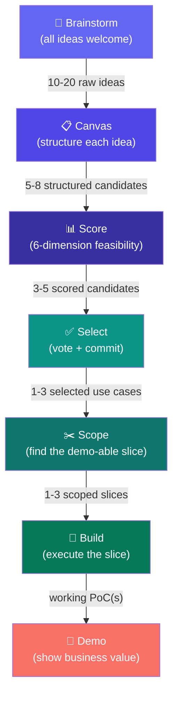
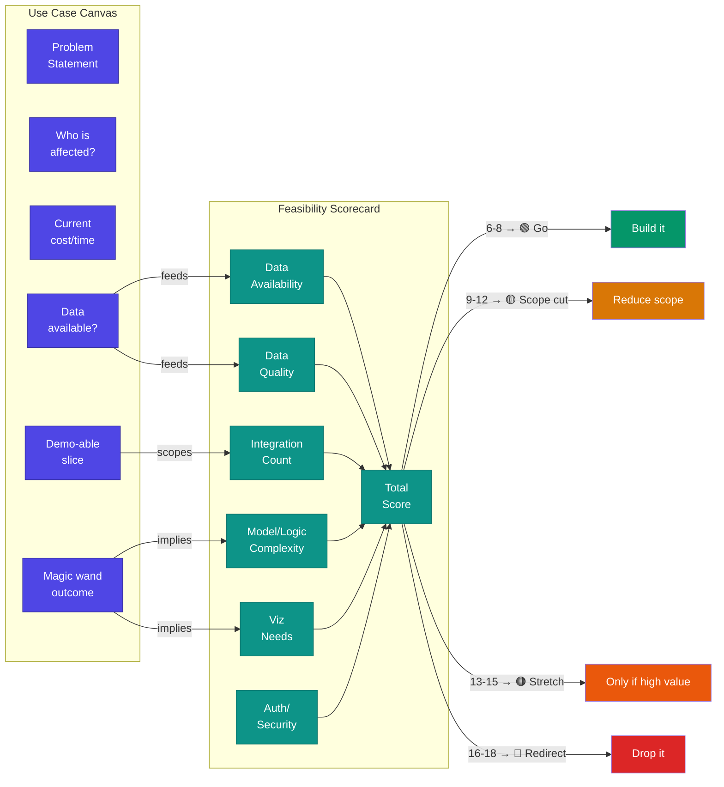

← [Concepts](./) | ← [README](../../README.md)

# Use-Case-Driven Development

Use-case-driven development is the core methodology behind hackathon execution. The principle is simple: **start from the business problem, not the technology.** Every technical decision — what to build, which accelerator to use, how to scope — flows from a clearly articulated use case with measurable business value.

---

## Core Philosophy

Hackathons fail when they become technology showcases. A perfect ML pipeline that solves no real problem impresses engineers but changes nothing for the customer. The inversion that works:

> **Business pain → use case → feasibility → scope → build → demo of value**

Not:

> ~~Technology → feature → demo of capability → hope customer finds it useful~~

This methodology ensures every line of code written during a hackathon is connected to a business outcome the customer cares about.

---

## The Use Case Funnel

Ideas enter wide and get narrowed through structured filters until only the most valuable, feasible candidates survive to build phase.



### Funnel Stages

| Stage | Tool | Who | What happens | Typical count |
|-------|------|-----|-------------|:-------------:|
| **Brainstorm** | Whiteboard / sticky notes | Everyone | Divergent thinking — no bad ideas | 10–20 |
| **Canvas** | [Use Case Canvas](../../templates/use-case-canvas.md) | Facilitator + customer | Structure each idea: problem, persona, data, outcome | 5–8 |
| **Score** | [Feasibility Scorecard](../../templates/feasibility-scorecard.md) | Architect + Data Wrangler | Rate across 6 dimensions (1–3 scale) | 3–5 |
| **Select** | Dot voting + squad confidence | Everyone | Commit to what gets built | 1–3 |
| **Scope** | Demo-able slice exercise | Architect + Builder | Cut to the minimum viable demo | 1–3 |
| **Build** | Accelerator packs + custom code | Builder + Data Wrangler | Execute the scoped slice | 1–3 |
| **Demo** | [Demo script template](../../templates/demo-script-template.md) | Demo Crafter | Present the business value story | 1–3 |

---

## How Canvas and Scorecard Work Together

The [Use Case Canvas](../../templates/use-case-canvas.md) captures the **why** and **what**. The [Feasibility Scorecard](../../templates/feasibility-scorecard.md) determines the **can we**.



**The handshake:**

| Canvas Field | Feeds Scorecard Dimension | How |
|-------------|--------------------------|-----|
| Data available? | Data Availability, Data Quality | Direct input — what exists and its state |
| Magic wand outcome | Model/Logic Complexity, Viz Needs | Ideal outcome reveals technical complexity |
| Demo-able slice | Integration Count | Scoped slice defines how many systems to connect |
| Problem statement | (all dimensions) | Grounds the entire scoring conversation |

---

## The Demo-able Slice

The demo-able slice is the **minimum viable demo** — the smallest thing the squad can build that proves business value. It's not a toy, and it's not production. It's the thing that makes a customer say *"Yes, that's what I need."*

### Finding the Slice

Ask these questions in order:

1. **What's the single most convincing screenshot?** — If you could only show one screen, what proves value?
2. **What data does that screen need?** — Trace backwards from the output to the minimum input
3. **What's the shortest path from input to output?** — Skip everything that isn't on the critical path
4. **What can be hardcoded?** — Auth, config, edge cases — hardcode it all for the demo
5. **What can use sample data?** — If customer data isn't ready, synthetic data that looks real is fine

### Slice Sizing Guide

| Format | Time for Build | Slice Target |
|--------|:-------------:|-------------|
| 1-day | ~4 hours | 1 use case, 1 demo screen, sample data OK |
| 2-day | ~8 hours | 2–3 use cases, end-to-end flow, real data preferred |

### What a Good Slice Looks Like

| Attribute | Good Slice | Bad Slice |
|-----------|-----------|----------|
| **Scope** | Single end-to-end flow | Half of three different flows |
| **Data** | Real or realistic sample data | "Hello World" placeholder |
| **Output** | Visual result a business user understands | Raw JSON or console output |
| **Story** | Tells a value narrative | Requires technical explanation |
| **Time** | Buildable in the allotted time | "Almost done" at demo time |

---

## Scope Management

Scope creep is the #1 killer of hackathon outcomes. The framework provides hard stops:

### Scope Gates

| Gate | When | Decision |
|------|------|----------|
| **Ideation exit** | End of ideation session | Lock selected use cases — no additions after this point |
| **Mid-build checkpoint** | Halfway through build time | Cut anything that won't be demo-ready |
| **Demo prep** | 1 hour before demo | Only demo what works — remove broken features from script |

### How to Cut Scope Without Losing Value

The cutting hierarchy (cut from the bottom up):

```
┌─────────────────────────────────┐
│  Business value story           │  ← NEVER cut this
├─────────────────────────────────┤
│  Core data flow (in → out)      │  ← Protect this
├─────────────────────────────────┤
│  Real customer data             │  ← Replace with sample if needed
├─────────────────────────────────┤
│  Multiple scenarios / edge cases│  ← Cut to happy path only
├─────────────────────────────────┤
│  Polish / UI / formatting       │  ← Cut freely
├─────────────────────────────────┤
│  Error handling / auth / RBAC   │  ← Cut for demo, note for prod
├─────────────────────────────────┤
│  Additional use cases           │  ← Cut entire use cases if needed
└─────────────────────────────────┘
```

**The rule:** A complete demo of one use case always beats partial demos of three.

---

## Connection to the Accelerator System

Use cases drive accelerator selection — not the other way around.

| Funnel Stage | Accelerator Decision |
|-------------|---------------------|
| **Brainstorm** | No pack decision yet — ideas first |
| **Canvas** | "Data available?" and "Magic wand outcome" hint at tech needs |
| **Score** | Scoring reveals which dimensions are hard — packs help lower scores |
| **Select** | Selected use cases determine which packs to load |
| **Scope** | Pack contents determine what's achievable in the time-box |
| **Build** | Pack notebooks become the starting point for customization |

**Example flow:**

1. Customer brainstorms: *"We want to predict equipment failures before they happen"*
2. Canvas reveals: sensor data in Azure IoT Hub, plant floor persona, 15% unplanned downtime
3. Scorecard: Data Availability = 1, Quality = 2, Integration = 2, Model Complexity = 2, Viz = 1, Auth = 1 → **Total: 9 (🟡 Go with scope cut)**
4. Scope cut: predict failures for one machine type, use historical data only (skip real-time for now)
5. Pack selection: **Fabric Lakehouse** (for data engineering) + **Power BI Reporting** (for dashboard)
6. Build: customize Lakehouse notebooks for sensor data, create failure prediction model, build dashboard
7. Demo: "Here's your top-10 machines most likely to fail this week" on a Power BI dashboard

---

## Why Business Value Beats Technical Impressiveness

| What engineers want to show | What customers want to see |
|:---------------------------:|:-------------------------:|
| Clean code architecture | Their problem getting solved |
| Elegant pipeline design | Time or money saved |
| Advanced ML model accuracy | A decision they can act on |
| Real-time streaming at scale | An answer they trust |

**The test:** If a non-technical executive can't understand the demo in 60 seconds, the demo needs rework — not the executive.

### The Value Story Structure

Every use case demo should follow this arc:

1. **The pain** — "Today, your team spends X hours doing Y manually"
2. **The proof** — "Here's what that looks like with your data" (live demo)
3. **The impact** — "This could save Z hours/dollars per month"
4. **The path** — "Here's what it takes to bring this to production"

This structure works because it starts and ends with business value, using the technical demo as evidence — not as the main act.

---

## 📎 Related Documents

| Document | Purpose |
|----------|---------|
| [Hackathon Lifecycle](hackathon-lifecycle.md) | Where use-case-driven development fits in the process |
| [Accelerator Architecture](accelerator-architecture.md) | How use case selection drives pack selection |
| [Use Case Canvas](../../templates/use-case-canvas.md) | Ideation brainstorming template |
| [Feasibility Scorecard](../../templates/feasibility-scorecard.md) | 6-dimension scoring framework |
| [Demo Script Template](../../templates/demo-script-template.md) | Structure for the value story presentation |
