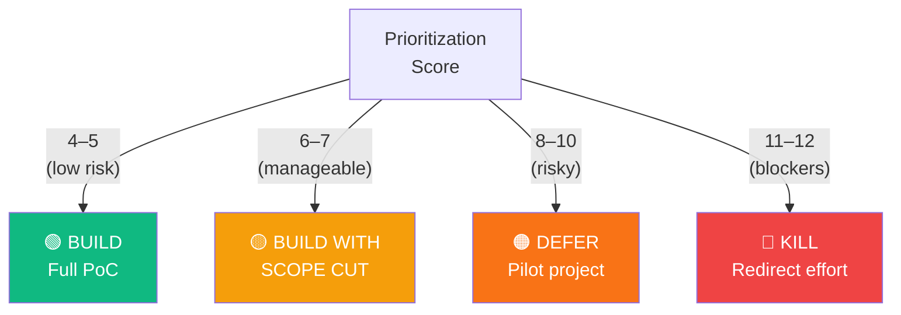
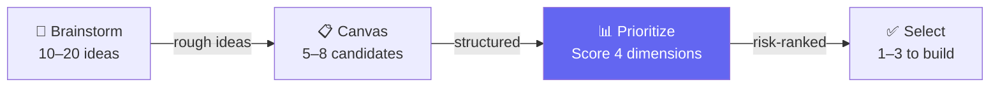

← [Concepts](./) | ← [README](../../README.md)

# Use Case Prioritization

Not all use cases are equal. A feasible idea with no business impact is a wasted build cycle. A high-impact idea with zero data readiness will stall on Day 1. **Prioritization** is how you rank ideas across multiple dimensions so the squad builds what matters most and is actually achievable in the time-box.

---

## The Four-Dimension Matrix

Use case prioritization evaluates each idea against four independent criteria:

| Dimension | What it measures | Scale | Why it matters |
|-----------|-----------------|-------|---------------|
| **Feasibility** | Can we build a demo with our time, data, and tools? | 1–3 | A brilliant idea that takes 6 hours is not hackathon material |
| **Business Impact** | How much would solving this problem matter to the customer? | 1–3 | If no one cares about the outcome, why demo it? |
| **Data Readiness** | Do we have access to complete, clean data — or can we simulate it? | 1–3 | Data access is a hard blocker; without it, everything else is moot |
| **Demo-ability** | Can we show the result live, or do we need screenshots and explanation? | 1–3 | A use case that only works in a Jupyter notebook isn't a business demo |

Each dimension scores **1 (low risk) to 3 (high risk)**. Total possible score: **4–12**. Lower is better.

### Scoring Rules

**1 = high confidence / low risk**
*Example:* "We've done this exact project twice before" (Feasibility) or "The CFO is in the room asking for this" (Impact)

**2 = moderate confidence / manageable risk**
*Example:* "Similar to past work but with a new data source" (Feasibility) or "It solves a real problem but only for one persona" (Impact)

**3 = low confidence / high risk**
*Example:* "This is our first time with this technique" (Feasibility) or "Nice-to-have but not urgent" (Impact)

---

## How to Run a Prioritization Session

Prioritization is a **group activity**, not a solo decision.

### Session Flow (30–45 minutes for 4–6 use cases)

| Phase | Time | What happens |
|-------|------|-------------|
| **Setup** | 2 min | Facilitator explains the four dimensions |
| **Scoring** | 20 min | Architect leads scoring, one use case at a time — customer input required |
| **Clustering** | 5 min | Group use cases by total score (4–5 = go, 6–7 = caution, 8+ = defer) |
| **Alignment** | 10 min | Customer confirms: *"Does this ranking match what matters to you?"* |

### The Scoring Conversation

For **each use case**, the Architect asks:

1. **Feasibility:** *"Looking at our time-box, data access, and the accelerators we have — how confident are we in building this demo?"*
2. **Business Impact:** *"If we delivered this working on Monday, how much would it move the needle for your operation?"*
3. **Data Readiness:** *"Do we have the data we need, or a way to simulate it realistically?"*
4. **Demo-ability:** *"Can we show this live in 5 minutes, or will we need videos and screenshots?"*

> **Tip:** Record the reasoning, not just the number. *"Feasibility = 3 because we need SAP access and IT hasn't confirmed"* is more useful than *"Feasibility = 3"*.

---

## Decision Framework: Build, Defer, or Kill

| Score | Decision | What to do |
|:-----:|----------|-----------|
| **4–5** | 🟢 **Build** | Commit full demo-able slice. No scope cuts needed. |
| **6–7** | 🟡 **Build (thin)** | Build only the absolute core. Accept limitations. |
| **8–10** | 🟠 **Defer** | Don't build in the hackathon. Flag as a good pilot. Document for follow-up. |
| **11–12** | 🔴 **Kill** | Redirect the team to a viable use case. |

### Example

*"Use Case: Predictive maintenance with real-time alerts"*

| Dimension | Score | Reasoning |
|-----------|:-----:|-----------|
| Feasibility | 3 | First time with edge compute; unfamiliar with customer's OT network |
| Impact | 1 | Reduces downtime by 20% — customer's #1 priority |
| Data Readiness | 2 | Have historical data; live sensor access blocked by IT policy |
| Demo-ability | 2 | Can show prediction, but not real-time alerts |
| **Total** | **8** | 🟠 **Defer** — Pilot project after IT unblocks sensor access |

*Better alternative:* Build a **static prediction demo** (batch scoring), defer real-time alerting to a 2-week pilot. Same impact story, lower technical risk.

---

## How Prioritization Connects to the Use Case Funnel

[Use-Case-Driven Development](use-case-driven-development.md) describes the full funnel from brainstorm to demo. Prioritization is the **scoring and selection stage** — where ideas get ranked and commitments are made.

---

## Anti-Patterns

| Anti-pattern | What it looks like | Why it fails |
|-------------|-------------------|-------------|
| **Wishful scoring** | Everything scores 1 or 2 | You're not being honest about constraints |
| **Customer veto** | *"We only want this one"* — regardless of feasibility | Customer desires matter, but not all are achievable in 8 hours |
| **Changing scores mid-build** | *"It's actually a 3, not a 2"* | Scores are estimates. Document what changed, but don't re-prioritize mid-build |
| **Ignoring demo-ability** | Building complex systems only shown in code | A demo requiring 10 min of explanation isn't a business demo |

---

## 📎 Related

| Document | Purpose |
|----------|---------|
| [Use-Case-Driven Development](use-case-driven-development.md) | The full funnel; prioritization is one stage |
| [Feasibility Scorecard](../../templates/feasibility-scorecard.md) | Template for 6-dimension scoring |
| [Scope Management](../principles/scope-management.md) | How to cut scope for high-risk, high-impact ideas |
| [Running Ideation](../guides/running-ideation.md) | Where prioritization happens |
