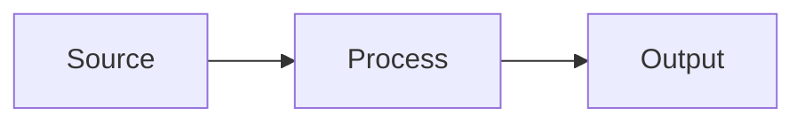

← [README](README.md) | 🎤 Demo Phase

# Demo Script — [Use Case Name]

**Duration:** ~5 minutes
**Presenter:** [FILL]
**Use Case:** UC-[###]

---

## 1. The Problem (30s)

> "Today, **[customer]** spends **[X hours/dollars]** on **[process]**. This is because **[root cause]**. It affects **[who]** and costs them **[impact]**."

## 2. The Solution (60s)

> "We built **[what]**. Data flows from **[source A]** through **[processing step B]** into **[output C]**. The key insight is **[what makes this approach work]**."

*Replace with actual architecture.*

## 3. The Live Demo (2-3 min)

| Step | Action | What Happens | Visual |
|------|--------|-------------|--------|
| 1 | [What you click / run] | [What the audience sees] | 📸 *[screenshot placeholder]* |
| 2 | [FILL] | [FILL] | 📸 |
| 3 | [FILL] | [FILL] | 📸 |
| 4 | [FILL] | [FILL] | 📸 |

**Backup plan if demo breaks:** [FILL — e.g., "Switch to pre-recorded video" or "Show static screenshots"]

## 4. The Impact (30s)

> "This reduces **[metric]** by **[X%]**, saving **[time/money]**. For [customer], that means **[business outcome]**."

## 5. The Ask (30s)

> "To take this further, we'd need **[next step]** — specifically **[resource / access / decision]**. We recommend **[concrete follow-up action]**."

---

## Pre-Demo Checklist

- [ ] Demo environment running and tested
- [ ] Sample data loaded
- [ ] Backup screenshots / recording ready
- [ ] Internet/VPN connectivity confirmed
- [ ] Presenter has walked through script at least once

---

## 📎 Related

| Document | Purpose |
|----------|--------|
| [Handoff](../HANDOFF.md) | Customer deliverable (includes demo walkthrough) |
| [Use Case Template](../use-cases/_template.md) | Source use case details |
| [Wind-Down Checklist](checklists.md) | Post-demo tasks |
