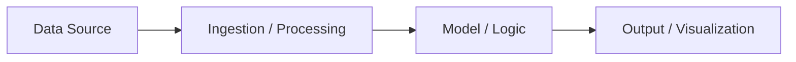

← [README](../README.md) | ← [Brief](../BRIEF.md) | 💡 Ideation → 🔨 Build

# Use Case: [Name]

**ID:** UC-[###]
**Status:** ⬜ Not Started / 🔨 In Progress / ✅ Demo-Ready

---

## Business Problem

**Pain Point:** [What is the specific problem?]

**Current Process:** [How is this handled today?]

**Cost / Time Impact:** [Quantify if possible — e.g., "40 hours/month of manual review"]

## Desired Outcome

*What does success look like? What would the customer see/experience?*

[FILL]

## Hypothesis

> We believe that **[solution approach]** will **[expected outcome]** for **[target persona]**, as measured by **[success signal]**.

---

## Feasibility Score

| Dimension | Score (1-3) | Notes |
|-----------|:-----------:|-------|
| Data Availability | [1/2/3] | [FILL] |
| Data Quality | [1/2/3] | [FILL] |
| Integration Count | [1/2/3] | [FILL] |
| Model / Logic Complexity | [1/2/3] | [FILL] |
| Visualization Needs | [1/2/3] | [FILL] |
| Auth / Security Constraints | [1/2/3] | [FILL] |
| **Total** | **[6-18]** | |

**Assessment:** 🟢 Go (6-8) / 🟡 Go with scope cut (9-12) / 🟠 Stretch (13-15) / 🔴 Redirect (16-18)

---

## Architecture Sketch

*Replace with actual architecture.*

## Data Requirements

| Source | Type | Quality | Sample Available? | Access Method |
|--------|------|---------|-------------------|---------------|
| [FILL] | [FILL] | Good / Fair / Poor | Yes / No | [FILL] |

## Architecture Decision Cards

*Decisions made for this use case. Full ADCs in `build/decisions/`.*

| ADC | Decision | Revisit? |
|-----|----------|----------|
| [ADC-###] | [FILL] | Yes / No |

---

## Build Status

- [ ] Data access confirmed
- [ ] Architecture agreed
- [ ] Core logic implemented
- [ ] Visualization / UI ready
- [ ] Demo script written
- [ ] Dry-run completed

---

## 📎 Related Documents

| Document | Purpose |
|----------|---------|
| [Use Case Canvas](../playbook/use-case-canvas.md) | Quick ideation card for brainstorming |
| [Feasibility Scorecard](../playbook/feasibility-scorecard.md) | Detailed scoring framework |
| [Demo Script Template](../playbook/demo-script-template.md) | Structure your demo |
| [ADC Template](../build/decisions/_template.md) | Record architecture decisions |
| → [Handoff](../HANDOFF.md) | **Next:** Customer deliverable |

## Demo Script

**Duration:** [X] minutes

1. **Setup:** [What the audience sees on screen before you start]
2. **Step 1:** [Action — what you click/run] → [What happens]
3. **Step 2:** [Action] → [Result]
4. **Step 3:** [Action] → [Result]
5. **Punchline:** [The "aha" moment]

---

## Outcome

**What was delivered:** [FILL]

**Customer reaction:** [FILL]

**Follow-up potential:** High / Medium / Low
